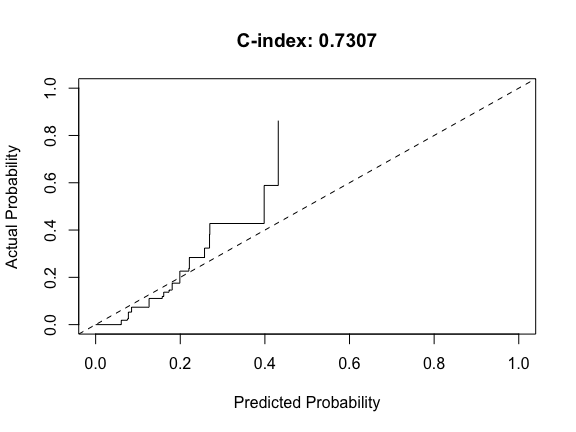

The csmpv R package provides an extensive set of functions that
encompass biomarker confirmation, variable selection, modeling,
predictive analysis, and validation. It can handle diverse outcome
variable types, including binary, continuous, and time-to-event data.
Its key objectives include:

-   Biomarker Confirmation/Validation: This feature employs both
    single-variable and multivariable regression techniques to confirm
    and validate established biomarkers.

-   Biomarker Discovery: The package streamlines the identification of
    new biomarkers through variable selection methods like LASSO2,
    LASSO\_plus, and LASSO2plus.

-   Predictive Model Development: By harnessing a fusion of machine
    learning and traditional statistical tools, this process facilitates
    the creation of predictive models focused on specific biomarkers.

-   Model Prediction: Developed models can predict outcomes when applied
    to new datasets.

-   Model Validation: These models validate outcomes when applied to
    novel datasets, provided an outcome variable is present.

To simplify the modeling process, we’ve designed an all-in-one function
capable of managing predictive model development, prediction, and
validation for all eight methods within this package across three
distinct outcome types. This versatile function streamlines the process,
allowing for a concise implementation with just a single function call.
It can handle a single method with single or multiple outcome variables.
Moreover, if a validation dataset is available, the prediction and
validation processes can seamlessly integrate into a unified operation.

In addition to these core functionalities, the csmpv package introduces
a unique approach allowing the creation of binary risk classification
models based on survival models. This innovative feature enables
predicting risk binary outcomes for new datasets using the developed
model. Please note, the external validation of this model is limited due
to the absence of binary classification variables in new datasets.
Despite this limitation, the predicted binary classification can serve
as a surrogate biomarker, and its correlation with survival outcomes in
new datasets can be tested when survival outcome information is
available.

To enhance user experience, the csmpv R package focuses on streamlining
coding efforts. Each user-end function acts as a comprehensive wrapper
condensing multiple analyses into a single function call. Additionally,
result files are conveniently saved locally, further simplifying the
analytical process.

# I Installation

The csmpv package is available on CRAN, and it can be directly installed
in R using the following command:

    install.packages("csmpv")

Alternatively, let’s proceed to install csmpv from GitHub using the
devtools or remotes R package.

    # Install devtools package if not already installed
    options(repos = c(CRAN = "https://cloud.r-project.org"))
    install.packages("devtools")

    # Install csmpv package from GitHub
    devtools::install_github("ajiangsfu/csmpv",force = TRUE)
    # Using force = TRUE will ensure the installation, overriding any existing versions

    # Install remotes package if not already installed
    install.packages("remotes")
    # Install csmpv package from GitHub
    remotes::install_github("ajiangsfu/csmpv",force = TRUE)
    # Using force = TRUE will ensure the installation, overriding any existing versions

Both methods will download and install the csmpv package from the GitHub
repository. Please ensure an active internet connection and the
necessary dependencies for a successful installation.

# II Example Code

In this section, we will show some example code, however, before that,
we will introduce example data first.

## 1. Example data

The example data was extracted from our in-house diffuse large B-cell
lymphoma (DLBCL) dataset, specifically utilizing supplemental Table S1
from Alduaij et al. (2023, DOI: 10.1182/blood.2022018248).

To handle missing values, we retained only samples with all the
necessary variables and no missing values. Furthermore, to ensure
compatibility with all eight modeling methods within csmpv, we
transformed all categorical variables into binary format, overcoming
limitations in XGBoost (eXtreme Gradient Boosting) and LASSO (Least
Absolute Shrinkage and Selection Operator) when dealing with categorical
variables with more than two levels.

Following these procedures, an object named datlist was generated and is
included in csmpv, accessible straightforwardly after installing and
loading csmpv, as demonstrated below.

    library(csmpv)

    ## Warning: package 'csmpv' was built under R version 4.4.3

    data("datlist", package = "csmpv")
    tdat = datlist$training
    dim(tdat)

    ## [1] 216  22

    vdat = datlist$validation
    dim(vdat)

    ## [1] 217  22

Subsequently, we defined three outcome variables and their respective
independent variables.

To illustrate different types of outcome variables, we’ll define
examples for binary, continuous, and time-to-event categories: - Binary:
DZsig (dark zone signature) - Continuous: Age - Time-to-event: FFP
(freedom from progression)

For the time-to-event outcome variable, independent variables are
defined as:

    Xvars = c("B.Symptoms","MYC.IHC","BCL2.IHC", "CD10.IHC","BCL6.IHC",
     "MUM1.IHC","Male","AgeOver60", "stage3_4","PS1","LDH.Ratio1",
     "Extranodal1","Bulk10cm","HANS_GCB", "DTI")

For the continuous outcome variable, the corresponding independent
variables align with those above, excluding AgeOver60 due to its
correlation with the outcome variable Age:

    AgeXvars = setdiff(Xvars, "AgeOver60")

For the binary variable, the corresponding independent variables align
with Xvars, excluding ‘HANS\_GCB’ since DZsig classification is
typically conducted within Germinal Center B-Cell (GCB) samples. In
fact, no non-GCB sample is DZsig positive in our training dataset.

    DZXvars = setdiff(Xvars, "HANS_GCB")

To enhance reproducibility and minimize variability from random number
generation, we established and set a specific random seed:

    set.seed(12345)

Users can define their own temporary directory to save all results. If
not, tempdir() can be used to get the system’s temporary directory.

    temp_dir = tempdir()
    knitr::opts_knit$set(root.dir = temp_dir)

## 2. Biomarker confirmation/validation

Whether this procedure is labeled as biomarker confirmation, validation,
or testing, the fundamental aspect involves regular regression analyses
on both single and multiple variables across three distinct outcome
categories: binary, continuous, and time-to-event. In this context, our
objective is to assess the presence of an association between outcomes
and a set of independent variables. It’s important to note that this
differs from model validation, which will be covered subsequently.

### 2.1 Binary outcome

To confirm biomarkers for binary outcomes:

    bconfirm = confirmVars(data = tdat, biomks = DZXvars, Y = "DZsig",
                           outfile = "confirmBinary")

The confirmVars function acts as a wrapper, invoking various functions
to perform regression analysis based on different outcome types. By
default, the outcome type is binary, requiring no explicit specification
when handling binary outcomes.

Upon execution, the bconfirm object comprises a multivariable model and
a list of two forest plots. The first plot consolidates individual
forest plots for each single variable, while the second represents the
forest plot for the multivariable model. These outputs are locally
saved, along with a combined table containing models for each single
variable.

    print(bconfirm$fit)

    ## 
    ## Call:  glm(formula = f1, family = "binomial", data = datain)
    ## 
    ## Coefficients:
    ## (Intercept)   B.Symptoms      MYC.IHC     BCL2.IHC     CD10.IHC     BCL6.IHC  
    ##    -10.7121      -1.6743       3.6114       1.0875       4.5701       2.1497  
    ##    MUM1.IHC         Male    AgeOver60     stage3_4          PS1   LDH.Ratio1  
    ##     -3.0488       1.2451       0.2259       1.0134       2.4096       0.8555  
    ## Extranodal1     Bulk10cm          DTI  
    ##      0.9935      -1.0209      -0.0278  
    ## 
    ## Degrees of Freedom: 215 Total (i.e. Null);  201 Residual
    ## Null Deviance:       154.8 
    ## Residual Deviance: 68.13     AIC: 98.13

    bconfirm$allplot[[2]]

    ## `height` was translated to `width`.

For instance, the above output showcases a multivariable model and it’s
corresponding forest plot.

### 2.2 Continous outcome

To confirm biomarkers for continuous outcomes:

    cconfirm = confirmVars(data = tdat, biomks = AgeXvars, Y = "Age",
                           outcomeType = "continuous",
                           outfile = "confirmContinuous")

The same confirmVars function is called; however, this time, we specify
the outcome type as continuous.

In a similar fashion, the cconfirm object comprises two elements: a
multivariable model and a list of two forest plots. The first plot
consolidates all forest plots for each single variable, while the second
represents the forest plot for the multivariable model. All these
outputs are saved locally, accompanied by a combined table containing
models for each single variable.

Below, you’ll find the multivariable model and it’s corresponding forest
plot:

    print(cconfirm$fit)

    ## 
    ## Call:  glm(formula = f1, data = datain)
    ## 
    ## Coefficients:
    ## (Intercept)   B.Symptoms      MYC.IHC     BCL2.IHC     CD10.IHC     BCL6.IHC  
    ##    62.21516     -4.12244      1.76448      2.10272     -0.73413      1.65380  
    ##    MUM1.IHC         Male     stage3_4          PS1   LDH.Ratio1  Extranodal1  
    ##     1.47318     -1.47252     -1.24508      7.81629      2.41929     -4.91746  
    ##    Bulk10cm     HANS_GCB          DTI  
    ##    -1.91890      0.09254     -0.03078  
    ## 
    ## Degrees of Freedom: 215 Total (i.e. Null);  201 Residual
    ## Null Deviance:       41610 
    ## Residual Deviance: 37060     AIC: 1756

    cconfirm$allplot[[2]]

    ## `height` was translated to `width`.

### 2.3 Time-to-event outcome

To confirm biomarkers for time-to-event outcomes:

    tconfirm = confirmVars(data = tdat, biomks = Xvars,
                           time = "FFP..Years.", event = "Code.FFP",
                           outcomeType = "time-to-event",
                           outfile = "confirmSurvival")

The confirmVars function is called once again, this time with the
outcome type specified as time-to-event, necessitating the inclusion of
both time and event variable names.

Similarly, two PDF and two table files are saved, accompanied by locally
stored Kaplan-Meier plots. A single Kaplan-Meier plot is generated for
each independent categorical variable with no more than four levels.

The tconfirm object also stores two elements: a multivariable model and
a list of two forest plots. Below, you’ll find the multivariable model
and it’s corresponding forest plot:

    print(tconfirm$fit)

    ## Call:
    ## survival::coxph(formula = as.formula(paste(survY, survX, sep = " ~ ")), 
    ##     data = datain)
    ## 
    ##                  coef exp(coef)  se(coef)      z        p
    ## B.Symptoms   0.242227  1.274083  0.254790  0.951  0.34176
    ## MYC.IHC      0.324999  1.384029  0.241800  1.344  0.17892
    ## BCL2.IHC     0.528284  1.696019  0.304773  1.733  0.08303
    ## CD10.IHC    -0.339371  0.712218  0.388523 -0.873  0.38240
    ## BCL6.IHC    -0.079421  0.923651  0.301262 -0.264  0.79207
    ## MUM1.IHC     0.265378  1.303924  0.323554  0.820  0.41210
    ## Male         0.509459  1.664390  0.239405  2.128  0.03334
    ## AgeOver60    0.275746  1.317513  0.268613  1.027  0.30463
    ## stage3_4     0.835319  2.305550  0.272658  3.064  0.00219
    ## PS1          0.615449  1.850486  0.251951  2.443  0.01458
    ## LDH.Ratio1   1.132954  3.104814  0.285240  3.972 7.13e-05
    ## Extranodal1  0.010644  1.010701  0.275702  0.039  0.96920
    ## Bulk10cm    -0.391782  0.675852  0.275208 -1.424  0.15457
    ## HANS_GCB     0.187281  1.205966  0.487752  0.384  0.70100
    ## DTI         -0.005751  0.994266  0.007605 -0.756  0.44953
    ## 
    ## Likelihood ratio test=79.96  on 15 df, p=7.114e-11
    ## n= 216, number of events= 85

    tconfirm$allplot[[2]]

    ## `height` was translated to `width`.

## 3. Biomarker discovery with variable selection

This section details the process of biomarker discovery through variable
selection, utilizing three distinct methods: LASSO2, LASSO2plus, and
LASSO\_plus.

### 3.1 Variable selection with LASSO2

The variable selection process using our customized LASSO algorithm,
LASSO2, employs a tailored approach distinct from the conventional LASSO
algorithm. This adjustment aims to address the randomness introduced by
random splits and to guarantee the inclusion of at least two variables.

This process utilizes glmnet::cv.glmnet for cross-validation-based
variable selection, setting lambda as the largest value where the error
remains within 1 standard error of the minimum. However, as indicated in
the cv.glmnet’s help file, variability in results can arise due to the
randomness inherent in cross-validation splits.

To counteract this variability, our new function, LASSO2, performs 10
runs of glmnet::cv.glmnet. The resulting average lambda value from these
iterations becomes the final lambda used for regularization regression
on the complete dataset.

It’s important to note that since LASSO2 selects the lambda as the
largest lambda within 1 standard error of the minimum, following the
default behavior of cv.glmnet, it may yield a smaller number of selected
variables compared to the lambda that minimizes the mean cross-validated
error. This more conservative approach could potentially result in only
one or no selected variables.

To address this potential issue, when LASSO2 identifies only one or no
variables, it defaults to selecting the first lambda that results in at
least two variables being chosen from the full dataset. This strategy
ensures the inclusion of at least two variables, striking a balance
between model complexity and the necessity for meaningful variable
inclusion.

#### 3.1.1 Binary outcome

For binary outcomes, no additional specification is needed for
outcomeType, as it is the default value.

    bl = LASSO2(data = tdat, biomks = DZXvars, Y = "DZsig",
                outfile = "binaryLASSO2")

One figure and one text file are saved locally.

    bl$coefs

    ##    MYC.IHC   CD10.IHC   MUM1.IHC 
    ##  0.8233711  1.4593539 -0.6663168

This displays the selected variables and their corresponding shrunken
coefficients.

#### 3.1.2 Continuous outcome

For variable selection involving a continuous outcome variable, specify
outcomeType = “continuous”:

    cl = LASSO2(data = tdat, biomks = AgeXvars,
                outcomeType = "continuous", Y = "Age",
                outfile = "continuousLASSO2")

Similar to before, one figure and one text file are saved locally.

    cl$coefs

    ##         PS1 Extranodal1 
    ##  3.07601980 -0.01348528

This shows the selected variables and their associated shrunken
coefficients for the continuous outcome.

#### 3.1.3 Time-to-event outcome

For variable selection with a time-to-event outcome, set outcomeType =
“time-to-event”, and ensure you provide the variable names for both time
and event:

    tl = LASSO2(data = tdat, biomks = Xvars,
                outcomeType = "time-to-event",
                time = "FFP..Years.",event = "Code.FFP",
                outfile = "survivalLASSO2")

In a similar fashion, one figure and one text file are saved locally.

    tl$coefs

    ##   stage3_4        PS1 LDH.Ratio1 
    ## 0.06293412 0.06799109 0.47091339

This shows the selected variables and their associated shrunk
coefficients for time-to-event outcome.

### 3.2 Variable selection with LASSO2plus

LASSO2plus is an innovative approach that combines LASSO2, a modified
LASSO algorithm, with other techniques. It selects variables in three
steps: - Apply LASSO2, which is slightly different from the standard
LASSO as discussed in Section 3.1. - Fit a simple regression model for
each variable and adjusting the p-values using the Benjamini Hochberg
method (1995). - Perform a stepwise variable selection procedure on the
combined list of variables from the previous steps. Therefore,
LASSO2plus can incorporates both the regularization and the significance
testing aspects of variable selection.

All parameter settings for LASSO2plus are the same as for LASSO2.

#### Binary outcome

For binary outcomes, no additional specification is needed for
outcomeType, as it is the default value.

    b2fit = LASSO2plus(data = tdat, biomks = DZXvars, Y = "DZsig",
            outfile = "binaryLASSO2plus")

    ## Start:  AIC=101.72
    ## DZsig ~ MYC.IHC + CD10.IHC + MUM1.IHC
    ## 
    ##            Df Deviance    AIC
    ## <none>           93.72 101.72
    ## - MUM1.IHC  1   107.09 113.09
    ## - MYC.IHC   1   115.41 121.41
    ## - CD10.IHC  1   119.33 125.33

    ## `height` was translated to `width`.
    ## file saved to binaryLASSO2plusLASSO2plus_varaibleSelection.pdf

    b2fit$fit$coefficients

    ## (Intercept)     MYC.IHC    CD10.IHC    MUM1.IHC 
    ##   -4.778565    2.503030    3.188996   -2.553409

The coefficients are shown above. Two figures and two tables are stored
locally.

#### Continuous outcome

For variable selection involving a continuous outcome variable, specify
outcomeType = “continuous”:

    c2fit = LASSO2plus(data = tdat, biomks = AgeXvars,
                       outcomeType = "continuous", Y = "Age",
                       outfile = "continuousLASSO2plus")

    ## Start:  AIC=1742.74
    ## Age ~ PS1 + Extranodal1
    ## 
    ##               Df Deviance    AIC
    ## <none>              38895 1742.7
    ## - Extranodal1  1    39626 1744.8
    ## - PS1          1    41202 1753.2

    ## `height` was translated to `width`.
    ## file saved to continuousLASSO2plusLASSO2plus_varaibleSelection.pdf

    c2fit$fit$coefficients

    ## (Intercept)         PS1 Extranodal1 
    ##   63.266769    7.011195   -4.700672

Again, the coefficients shown above and Two figures and two tables are
stored locally.

#### Time-to-event outcome

For variable selection with a time-to-event outcome, set outcomeType =
“time-to-event”, and ensure you provide the variable names for both time
and event:

    t2fit = LASSO2plus(data = tdat, biomks = Xvars,
                       outcomeType = "time-to-event",
                       time = "FFP..Years.",event = "Code.FFP",
                       outfile = "survivalLASSO2plus")

    ## Start:  AIC=813.41
    ## survival::Surv(FFP..Years., Code.FFP) ~ stage3_4 + PS1 + LDH.Ratio1 + 
    ##     HANS_GCB + B.Symptoms + DTI + CD10.IHC + MUM1.IHC
    ## 
    ##              Df    AIC
    ## - HANS_GCB    1 811.43
    ## - B.Symptoms  1 811.65
    ## - DTI         1 812.01
    ## - CD10.IHC    1 812.10
    ## - MUM1.IHC    1 812.37
    ## <none>          813.41
    ## - PS1         1 816.98
    ## - stage3_4    1 822.32
    ## - LDH.Ratio1  1 824.10
    ## 
    ## Step:  AIC=811.43
    ## survival::Surv(FFP..Years., Code.FFP) ~ stage3_4 + PS1 + LDH.Ratio1 + 
    ##     B.Symptoms + DTI + CD10.IHC + MUM1.IHC
    ## 
    ##              Df    AIC
    ## - B.Symptoms  1 809.66
    ## - DTI         1 810.04
    ## - CD10.IHC    1 810.58
    ## - MUM1.IHC    1 810.62
    ## <none>          811.43
    ## - PS1         1 814.99
    ## - stage3_4    1 820.94
    ## - LDH.Ratio1  1 822.13
    ## 
    ## Step:  AIC=809.66
    ## survival::Surv(FFP..Years., Code.FFP) ~ stage3_4 + PS1 + LDH.Ratio1 + 
    ##     DTI + CD10.IHC + MUM1.IHC
    ## 
    ##              Df    AIC
    ## - DTI         1 808.46
    ## - MUM1.IHC    1 808.86
    ## - CD10.IHC    1 808.94
    ## <none>          809.66
    ## - PS1         1 814.13
    ## - stage3_4    1 819.20
    ## - LDH.Ratio1  1 820.45
    ## 
    ## Step:  AIC=808.46
    ## survival::Surv(FFP..Years., Code.FFP) ~ stage3_4 + PS1 + LDH.Ratio1 + 
    ##     CD10.IHC + MUM1.IHC
    ## 
    ##              Df    AIC
    ## - CD10.IHC    1 807.66
    ## - MUM1.IHC    1 807.79
    ## <none>          808.46
    ## - PS1         1 813.12
    ## - stage3_4    1 818.06
    ## - LDH.Ratio1  1 824.55
    ## 
    ## Step:  AIC=807.66
    ## survival::Surv(FFP..Years., Code.FFP) ~ stage3_4 + PS1 + LDH.Ratio1 + 
    ##     MUM1.IHC
    ## 
    ##              Df    AIC
    ## <none>          807.66
    ## - MUM1.IHC    1 808.22
    ## - PS1         1 813.79
    ## - stage3_4    1 817.87
    ## - LDH.Ratio1  1 824.33

    ## `height` was translated to `width`.
    ## file saved to survivalLASSO2plusLASSO2plus_varaibleSelection.pdf

    t2fit$fit$coefficients

    ##   stage3_4        PS1 LDH.Ratio1   MUM1.IHC 
    ##  0.8231937  0.6543237  1.0529572  0.3508003

Similar to the other types of outcomes, the coefficients are displayed
above, and two figures along with two tables are stored locally.

### 3.3. Variable selection with LASSO\_plus

LASSO\_plus is another innovative approach that builds on the LASSO
algorithm and adds more techniques. However, it differs from LASSO2plus
that is described in Section 3.2 in its initial step. It selects
variables in the following three steps:

-   1.  Utilize ‘Modified LASSO’ for regularization regression instead
        of LASSO2 involves selecting a list, appearing at least two
        times during lambda simulations, based on the number of
        variables, and aiming to find the one nearest to a predefined
        target.
-   1.  Fit a simple regression model for each variable and adjusting
        the p-values using the Benjamini Hochberg method (1995);
-   1.  Perform a stepwise variable selection procedure on the combined
        list of variables from the previous steps. Therefore,
        LASSO\_plus also incorporates both the regularization and the
        significance testing aspects of variable selection.

In LASSO\_plus, all parameters from LASSO2 and LASSO2plus are retained,
with the addition of the unique parameter topN. Please be aware that the
topN parameter in LASSO\_plus serves as a guide for variable selection.

#### Binary outcome

Setting the topN parameter to 5 is intended to incorporate the top 5
variables into the final model. However, it’s important to note that the
resulting model may not always precisely comprise 5 variables.
Consequently, when using the same topN value for different datasets, the
number of selected variables may vary.

For binary outcomes, outcome type specification is unnecessary, as it
defaults to this type.

    bfit = LASSO_plus(data = tdat, biomks = DZXvars, Y = "DZsig",
                      outfile = "binaryLASSO_plus", topN = 5)

    ## Start:  AIC=101.72
    ## DZsig ~ MYC.IHC + CD10.IHC + MUM1.IHC
    ## 
    ##            Df Deviance    AIC
    ## <none>           93.72 101.72
    ## - MUM1.IHC  1   107.09 113.09
    ## - MYC.IHC   1   115.41 121.41
    ## - CD10.IHC  1   119.33 125.33

    ## `height` was translated to `width`.
    ## file saved to binaryLASSO_plus_LASSO_plus_varaibleSelection.pdf

    bfit$fit$coefficients

    ## (Intercept)     MYC.IHC    CD10.IHC    MUM1.IHC 
    ##   -4.778565    2.503030    3.188996   -2.553409

The identified variables and their corresponding coefficients are
displayed above. A figure and a table are locally stored.

#### Continuous outcome

For continuous outcome variables, ensure you specify outcomeType =
“continuous”:

    cfit = LASSO_plus(data = tdat, biomks = AgeXvars,
                      outcomeType = "continuous", Y = "Age",
                      outfile = "continuousLASSO_plus", topN = 5)

    ## Start:  AIC=1745.43
    ## Age ~ MUM1.IHC + Male + PS1 + LDH.Ratio1 + Extranodal1
    ## 
    ##               Df Deviance    AIC
    ## - LDH.Ratio1   1    38409 1744.0
    ## - Male         1    38469 1744.4
    ## - MUM1.IHC     1    38527 1744.7
    ## <none>              38303 1745.4
    ## - Extranodal1  1    39063 1747.7
    ## - PS1          1    39749 1751.4
    ## 
    ## Step:  AIC=1744.03
    ## Age ~ MUM1.IHC + Male + PS1 + Extranodal1
    ## 
    ##               Df Deviance    AIC
    ## - Male         1    38610 1743.2
    ## - MUM1.IHC     1    38640 1743.3
    ## <none>              38409 1744.0
    ## - Extranodal1  1    39174 1746.3
    ## - PS1          1    40373 1752.8
    ## 
    ## Step:  AIC=1743.15
    ## Age ~ MUM1.IHC + PS1 + Extranodal1
    ## 
    ##               Df Deviance    AIC
    ## - MUM1.IHC     1    38895 1742.7
    ## <none>              38610 1743.2
    ## - Extranodal1  1    39383 1745.4
    ## - PS1          1    40715 1752.6
    ## 
    ## Step:  AIC=1742.74
    ## Age ~ PS1 + Extranodal1
    ## 
    ##               Df Deviance    AIC
    ## <none>              38895 1742.7
    ## - Extranodal1  1    39626 1744.8
    ## - PS1          1    41202 1753.2

    ## `height` was translated to `width`.
    ## file saved to continuousLASSO_plus_LASSO_plus_varaibleSelection.pdf

    cfit$fit$coefficients

    ## (Intercept)         PS1 Extranodal1 
    ##   63.266769    7.011195   -4.700672

The identified variables and their corresponding coefficients are
displayed above. A figure and a table are locally stored

#### Time-to-event outcome

When dealing with time-to-event outcomes, set outcomeType =
“time-to-event”, and ensure you provide the names of variables for both
time and event:

    tfit = LASSO_plus(data = tdat, biomks = Xvars,
                      outcomeType = "time-to-event",
                      time = "FFP..Years.",event = "Code.FFP",
                      outfile = "survivalLASSO_plus", topN = 5)

    ## Start:  AIC=811.93
    ## survival::Surv(FFP..Years., Code.FFP) ~ BCL2.IHC + stage3_4 + 
    ##     PS1 + LDH.Ratio1 + HANS_GCB + B.Symptoms + DTI + CD10.IHC + 
    ##     MUM1.IHC
    ## 
    ##              Df    AIC
    ## - HANS_GCB    1 810.06
    ## - DTI         1 810.26
    ## - B.Symptoms  1 810.44
    ## - MUM1.IHC    1 810.61
    ## - CD10.IHC    1 811.03
    ## <none>          811.93
    ## - BCL2.IHC    1 813.41
    ## - PS1         1 815.39
    ## - stage3_4    1 820.54
    ## - LDH.Ratio1  1 824.07
    ## 
    ## Step:  AIC=810.06
    ## survival::Surv(FFP..Years., Code.FFP) ~ BCL2.IHC + stage3_4 + 
    ##     PS1 + LDH.Ratio1 + B.Symptoms + DTI + CD10.IHC + MUM1.IHC
    ## 
    ##              Df    AIC
    ## - DTI         1 808.41
    ## - B.Symptoms  1 808.53
    ## - MUM1.IHC    1 808.62
    ## - CD10.IHC    1 809.45
    ## <none>          810.06
    ## - BCL2.IHC    1 811.43
    ## - PS1         1 813.41
    ## - stage3_4    1 818.84
    ## - LDH.Ratio1  1 822.17
    ## 
    ## Step:  AIC=808.41
    ## survival::Surv(FFP..Years., Code.FFP) ~ BCL2.IHC + stage3_4 + 
    ##     PS1 + LDH.Ratio1 + B.Symptoms + CD10.IHC + MUM1.IHC
    ## 
    ##              Df    AIC
    ## - MUM1.IHC    1 806.98
    ## - B.Symptoms  1 807.07
    ## - CD10.IHC    1 807.77
    ## <none>          808.41
    ## - BCL2.IHC    1 810.04
    ## - PS1         1 811.66
    ## - stage3_4    1 817.22
    ## - LDH.Ratio1  1 825.31
    ## 
    ## Step:  AIC=806.98
    ## survival::Surv(FFP..Years., Code.FFP) ~ BCL2.IHC + stage3_4 + 
    ##     PS1 + LDH.Ratio1 + B.Symptoms + CD10.IHC
    ## 
    ##              Df    AIC
    ## - B.Symptoms  1 805.67
    ## <none>          806.98
    ## - CD10.IHC    1 807.33
    ## - BCL2.IHC    1 809.34
    ## - PS1         1 810.11
    ## - stage3_4    1 815.89
    ## - LDH.Ratio1  1 823.62
    ## 
    ## Step:  AIC=805.67
    ## survival::Surv(FFP..Years., Code.FFP) ~ BCL2.IHC + stage3_4 + 
    ##     PS1 + LDH.Ratio1 + CD10.IHC
    ## 
    ##              Df    AIC
    ## <none>          805.67
    ## - CD10.IHC    1 806.28
    ## - BCL2.IHC    1 807.79
    ## - PS1         1 810.33
    ## - stage3_4    1 814.88
    ## - LDH.Ratio1  1 823.04

    ## `height` was translated to `width`.
    ## file saved to survivalLASSO_plus_LASSO_plus_varaibleSelection.pdf

    tfit$fit$coefficients

    ##   BCL2.IHC   stage3_4        PS1 LDH.Ratio1   CD10.IHC 
    ##  0.5624989  0.7912045  0.6026647  1.0807901 -0.3868876

Displayed above are the identified variables and their corresponding
coefficients. A figure and a table are locally stored

## 4. Predictive model development

Predictive model development is a crucial aspect of the csmpv R package,
involving eight distinct approaches:

-   Use shrunk coefficients directly from LASSO2.
-   Select variables with LASSO2, then run a regular regression model.
-   Extract coefficients directly from LASSO\_plus output.
-   Extract coefficients directly from LASSO2plus output.
-   Build a machine learning model with XGBoost.
-   Utilize LASSO2 for variable selection and build an XGBoost model.
-   Utilize LASSO\_plus for variable selection and build an XGBoost
    model.
-   Utilize LASSO2plus for variable selection and build an XGBoost
    model.

### 4.1 LASSO2

Directly use shrunk coefficients from LASSO2 output as shown in Section
3.1.

### 4.2 LASSO2 + regular regression

The approach involves utilizing the variables selected by LASSO2 to
conduct a standard regression model. Rather than relying on the shrunken
coefficients obtained from LASSO2, this method opts for a conventional
regression analysis with the chosen variables.

While it’s feasible to manually extract variables from an LASSO2 object
for regular regression based on the outcome type, LASSO2\_reg function
is introduced to simplify this process for coding convenience and
efficiency.

All parameter settings are the same as for LASSO2.

#### Binary outcome

    blr = LASSO2_reg(data = tdat, biomks = DZXvars, Y = "DZsig",
                     outfile = "binaryLASSO2_reg")

    blr$fit$coefficients

    ## (Intercept)     MYC.IHC    CD10.IHC    MUM1.IHC         PS1 
    ##   -5.814411    2.918828    3.593155   -2.798703    1.583795

#### Continuous outcome

    clr = LASSO2_reg(data = tdat, biomks = AgeXvars,
                     outcomeType = "continuous", Y = "Age",
                     outfile = "continuousLASSO2_reg")

    clr$fit$coefficients

    ## (Intercept)         PS1 Extranodal1 
    ##   63.266769    7.011195   -4.700672

#### Time-to-event outcome

    tlr = LASSO2_reg(data = tdat, biomks = Xvars,
                     outcomeType = "time-to-event",
                     time = "FFP..Years.",event = "Code.FFP",
                     outfile = "survivalLASSO2_reg")

    tlr$fit$coefficients

    ##   stage3_4        PS1 LDH.Ratio1 
    ##  0.8406613  0.6921943  1.0459259

The selected variables and their coefficients are displayed above. For
each outcome type, three figure files, one text file, and two tables are
saved locally. Furthermore, Kaplan-Meier plots are generated and saved
locally for time-to-event outcome variables. Specifically, a single
Kaplan-Meier plot is produced for each independent categorical variable,
with no more than four levels.

### 4.3 LASSO\_plus

Directly use coefficients from LASSO2\_plus output as shown in Section
3.3.

### 4.4 LASSO2plus

Directly use coefficients from the LASSO2plus output, as described in
Section 3.2.

### 4.5 XGBoost

XGBoost is a powerful machine learning algorithm recognized for its
boosting capabilities. The XGBtraining function within the csmpv package
leverages the strengths of XGBoost for model training. As XGBoost
doesn’t inherently feature a dedicated variable selection procedure,
you’ll need to manually define or select a set of variables using other
methods. Once you have a predefined set of variables for constructing an
XGBoost model, the XGBtraining function in the csmpv package streamlines
this process.

#### Binary outcome

    bxfit = XGBtraining(data = tdat, biomks = DZXvars, Y = "DZsig",
                        outfile = "binary_XGBoost")

    ## [1]  train-logloss:0.511725 
    ## [2]  train-logloss:0.410088 
    ## [3]  train-logloss:0.344869 
    ## [4]  train-logloss:0.299378 
    ## [5]  train-logloss:0.265560

    head(bxfit$XGBoost_score)

    ##     pt103     pt246     pt874     pt219     pt138     pt328 
    ## 0.2255560 0.1192609 0.7288513 0.1137999 0.1708665 0.1634811

The output from the above code consists of training log-loss values for
specific iterations of the model. Log-loss, a widely used loss function
in classification tasks, assesses the alignment between the model’s
predicted probabilities and the actual class labels. By default,
XGBtraining runs for 5 iterations, and the output is saved locally as a
text file.

The bxfit object contains four components:

-   XGBoost object.
-   XGBoost scores for all entries in the tdat dataset. Notably, XGBoost
    operates as a black box model and doesn’t return coefficients;
    however, it provides model scores. For binary outcomes, these scores
    represent the probability of the positive class.
-   Observed outcome.
-   Outcome type.

#### Continuous outcome

    cxfit = XGBtraining(data = tdat, biomks = AgeXvars,
                        outcomeType = "continuous", Y = "Age",
                        outfile = "continuous_XGBoost")

    ## [1]  train-rmse:47.112278 
    ## [2]  train-rmse:34.492776 
    ## [3]  train-rmse:26.071191 
    ## [4]  train-rmse:20.612785 
    ## [5]  train-rmse:17.143179

    head(cxfit$XGBoost_score)

    ##    pt103    pt246    pt874    pt219    pt138    pt328 
    ## 53.85317 51.35439 55.58077 53.24583 51.35439 53.32356

The reported values, denoted by “train-rmse”, signify the RMSE metric
calculated during each iteration of the XGBoost model on the training
set. RMSE measures the root mean squared error between predicted and
actual values in the training set, with lower values indicating superior
model performance. The results are saved locally in a text file.

These metrics illustrate the iterative nature of training the XGBoost
model, where each iteration aims to minimize the RMSE on the training
set. The diminishing RMSE values signify the model’s learning process,
demonstrating its progressive improvement in predictive accuracy during
training.

Within cxfit, there are four elements:

-   XGBoost object.
-   XGBoost scores for all entries in tdat. Notably, XGBoost,
    functioning as a black box model, does not yield coefficients but
    provides model scores. For continuous outcomes, these scores
    represent the estimated continuous values.
-   Observed outcome.
-   Outcome type.

#### Time-to-event outcome

    txfit = XGBtraining(data = tdat, biomks = Xvars,
                        outcomeType = "time-to-event",
                        time = "FFP..Years.",event = "Code.FFP",
                        outfile = "survival_XGBoost")

    ## [1]  train-cox-nloglik:4.859147 
    ## [2]  train-cox-nloglik:4.727730 
    ## [3]  train-cox-nloglik:4.639868 
    ## [4]  train-cox-nloglik:4.556118 
    ## [5]  train-cox-nloglik:4.480807

    head(txfit$XGBoost_score)

    ##     pt103     pt246     pt874     pt219     pt138     pt328 
    ## 1.1596291 0.2782919 1.8487397 0.3992270 0.1841367 0.4014272

The negative log-likelihood, displayed in the output, serves as a
standard loss function in survival analysis, notably prominent in Cox
proportional hazards models. It quantifies the disparity between
predicted survival probabilities and observed survival times and events
within the training data. Minimizing this metric is crucial, as lower
values signify a better fit of the model to the training data. The
resulting output is saved locally as a text file.

By monitoring the negative log-likelihood throughout the training
process, you can evaluate the model’s learning progress and its
convergence toward an optimal solution. Ideally, a decreasing trend in
the negative log-likelihood indicates the model’s improved fit to the
training data across iterations.

In txfit, there are six components:

-   XGBoost object.
-   XGBoost scores for all entries in tdat. Notably, XGBoost operates as
    a black box model and does not yield coefficients but provides model
    scores. For time-to-event outcomes, these scores represent the risk
    score.
-   Baseline hazard table.
-   Observed time.
-   Event.
-   Outcome type.

### 4.6 LASSO2 + XGBoost

Combine LASSO2 variable selection with XGBoost modeling using the
LASSO2\_XGBtraining function, which selects variables via LASSO2 but
constructs an XGBoost model without relying on shrunk coefficients. The
resulting objects maintain the same format as XGBtraining, while the
results related to LASSO2 and XGBoost are saved locally.

#### Binary outcome

    blxfit = LASSO2_XGBtraining(data = tdat, biomks = DZXvars, Y = "DZsig",
                                outfile = "binary_LASSO2_XGBoost")

    ## [1]  train-logloss:0.511725 
    ## [2]  train-logloss:0.410850 
    ## [3]  train-logloss:0.348831 
    ## [4]  train-logloss:0.308959 
    ## [5]  train-logloss:0.283560

    head(blxfit$XGBoost_score)

    ##     pt103     pt246     pt874     pt219     pt138     pt328 
    ## 0.2034558 0.1193058 0.6517244 0.1193058 0.2034558 0.2034558

#### Continuous outcome

    clxfit = LASSO2_XGBtraining(data = tdat, biomks = AgeXvars,
                                outcomeType = "continuous", Y = "Age",
                                outfile = "continuous_LASSO2_XGBoost")

    ## [1]  train-rmse:47.112278 
    ## [2]  train-rmse:34.492776 
    ## [3]  train-rmse:26.089994 
    ## [4]  train-rmse:20.708504 
    ## [5]  train-rmse:17.428401

    head(clxfit$XGBoost_score)

    ##    pt103    pt246    pt874    pt219    pt138    pt328 
    ## 55.25286 52.70055 55.25286 52.70055 52.70055 52.70055

#### Time-to-event outcome

    tlxfit = LASSO2_XGBtraining(data = tdat, biomks = Xvars,
                                outcomeType = "time-to-event",
                                time = "FFP..Years.",event = "Code.FFP",
                                outfile = "survival_LASSO2_XGBoost")

    ## [1]  train-cox-nloglik:4.877358 
    ## [2]  train-cox-nloglik:4.794336 
    ## [3]  train-cox-nloglik:4.753116 
    ## [4]  train-cox-nloglik:4.731888 
    ## [5]  train-cox-nloglik:4.718628

    head(tlxfit$XGBoost_score)

    ##     pt103     pt246     pt874     pt219     pt138     pt328 
    ## 1.4941338 0.3127891 1.4941338 0.3127891 0.2222639 0.7933456

### 4.7 LASSO\_plus + XGBoost

To combine LASSO\_plus variable selection with XGBoost modeling, the
LASSO\_plus\_XGBtraining R function is employed. This approach selects
variables using LASSO\_plus but does not utilize the coefficients from
LASSO\_plus to construct the model; instead, it generates an XGBoost
model.

The format of the returned objects are identical to those of the
XGBtraining function, while results related to LASSO\_plus and XGBoost
are saved locally.

#### Binary outcome

    blpxfit = LASSO_plus_XGBtraining(data = tdat, biomks = DZXvars, Y = "DZsig",
                                     topN = 5,outfile = "binary_LASSO_plus_XGBoost")

    ## Start:  AIC=101.72
    ## DZsig ~ MYC.IHC + CD10.IHC + MUM1.IHC
    ## 
    ##            Df Deviance    AIC
    ## <none>           93.72 101.72
    ## - MUM1.IHC  1   107.09 113.09
    ## - MYC.IHC   1   115.41 121.41
    ## - CD10.IHC  1   119.33 125.33

    ## `height` was translated to `width`.
    ## file saved to binary_LASSO_plus_XGBoost_LASSO_plus_varaibleSelection.pdf

    ## [1]  train-logloss:0.511725 
    ## [2]  train-logloss:0.410850 
    ## [3]  train-logloss:0.348831 
    ## [4]  train-logloss:0.308959 
    ## [5]  train-logloss:0.283560

    head(blpxfit$XGBoost_score)

    ##     pt103     pt246     pt874     pt219     pt138     pt328 
    ## 0.2034558 0.1193058 0.6517244 0.1193058 0.2034558 0.2034558

The majority of the outputs stem from LASSO\_plus, with the final
portion being attributed to XGBoost.

#### Continuous outcome

    clpxfit = LASSO_plus_XGBtraining(data = tdat, biomks = AgeXvars,
                                     outcomeType = "continuous", Y = "Age",
                                     topN = 5,outfile = "continuous_LASSO_plus_XGBoost")

    ## Start:  AIC=1745.43
    ## Age ~ MUM1.IHC + Male + PS1 + LDH.Ratio1 + Extranodal1
    ## 
    ##               Df Deviance    AIC
    ## - LDH.Ratio1   1    38409 1744.0
    ## - Male         1    38469 1744.4
    ## - MUM1.IHC     1    38527 1744.7
    ## <none>              38303 1745.4
    ## - Extranodal1  1    39063 1747.7
    ## - PS1          1    39749 1751.4
    ## 
    ## Step:  AIC=1744.03
    ## Age ~ MUM1.IHC + Male + PS1 + Extranodal1
    ## 
    ##               Df Deviance    AIC
    ## - Male         1    38610 1743.2
    ## - MUM1.IHC     1    38640 1743.3
    ## <none>              38409 1744.0
    ## - Extranodal1  1    39174 1746.3
    ## - PS1          1    40373 1752.8
    ## 
    ## Step:  AIC=1743.15
    ## Age ~ MUM1.IHC + PS1 + Extranodal1
    ## 
    ##               Df Deviance    AIC
    ## - MUM1.IHC     1    38895 1742.7
    ## <none>              38610 1743.2
    ## - Extranodal1  1    39383 1745.4
    ## - PS1          1    40715 1752.6
    ## 
    ## Step:  AIC=1742.74
    ## Age ~ PS1 + Extranodal1
    ## 
    ##               Df Deviance    AIC
    ## <none>              38895 1742.7
    ## - Extranodal1  1    39626 1744.8
    ## - PS1          1    41202 1753.2

    ## `height` was translated to `width`.
    ## file saved to continuous_LASSO_plus_XGBoost_LASSO_plus_varaibleSelection.pdf

    ## [1]  train-rmse:47.112278 
    ## [2]  train-rmse:34.492776 
    ## [3]  train-rmse:26.089994 
    ## [4]  train-rmse:20.708504 
    ## [5]  train-rmse:17.428401

    head(clpxfit$XGBoost_score)

    ##    pt103    pt246    pt874    pt219    pt138    pt328 
    ## 55.25286 52.70055 55.25286 52.70055 52.70055 52.70055

Similar to the previous scenario, the primary outputs stem from
LASSO\_plus, while the concluding section originates from XGBoost.

#### Time-to-event outcome

    tlpxfit = LASSO_plus_XGBtraining(data = tdat, biomks = Xvars,
                                     outcomeType = "time-to-event",
                                     time = "FFP..Years.",event = "Code.FFP",
                                     topN = 5,outfile = "survival_LASSO_plus_XGBoost")

    ## Start:  AIC=811.93
    ## survival::Surv(FFP..Years., Code.FFP) ~ BCL2.IHC + stage3_4 + 
    ##     PS1 + LDH.Ratio1 + HANS_GCB + B.Symptoms + DTI + CD10.IHC + 
    ##     MUM1.IHC
    ## 
    ##              Df    AIC
    ## - HANS_GCB    1 810.06
    ## - DTI         1 810.26
    ## - B.Symptoms  1 810.44
    ## - MUM1.IHC    1 810.61
    ## - CD10.IHC    1 811.03
    ## <none>          811.93
    ## - BCL2.IHC    1 813.41
    ## - PS1         1 815.39
    ## - stage3_4    1 820.54
    ## - LDH.Ratio1  1 824.07
    ## 
    ## Step:  AIC=810.06
    ## survival::Surv(FFP..Years., Code.FFP) ~ BCL2.IHC + stage3_4 + 
    ##     PS1 + LDH.Ratio1 + B.Symptoms + DTI + CD10.IHC + MUM1.IHC
    ## 
    ##              Df    AIC
    ## - DTI         1 808.41
    ## - B.Symptoms  1 808.53
    ## - MUM1.IHC    1 808.62
    ## - CD10.IHC    1 809.45
    ## <none>          810.06
    ## - BCL2.IHC    1 811.43
    ## - PS1         1 813.41
    ## - stage3_4    1 818.84
    ## - LDH.Ratio1  1 822.17
    ## 
    ## Step:  AIC=808.41
    ## survival::Surv(FFP..Years., Code.FFP) ~ BCL2.IHC + stage3_4 + 
    ##     PS1 + LDH.Ratio1 + B.Symptoms + CD10.IHC + MUM1.IHC
    ## 
    ##              Df    AIC
    ## - MUM1.IHC    1 806.98
    ## - B.Symptoms  1 807.07
    ## - CD10.IHC    1 807.77
    ## <none>          808.41
    ## - BCL2.IHC    1 810.04
    ## - PS1         1 811.66
    ## - stage3_4    1 817.22
    ## - LDH.Ratio1  1 825.31
    ## 
    ## Step:  AIC=806.98
    ## survival::Surv(FFP..Years., Code.FFP) ~ BCL2.IHC + stage3_4 + 
    ##     PS1 + LDH.Ratio1 + B.Symptoms + CD10.IHC
    ## 
    ##              Df    AIC
    ## - B.Symptoms  1 805.67
    ## <none>          806.98
    ## - CD10.IHC    1 807.33
    ## - BCL2.IHC    1 809.34
    ## - PS1         1 810.11
    ## - stage3_4    1 815.89
    ## - LDH.Ratio1  1 823.62
    ## 
    ## Step:  AIC=805.67
    ## survival::Surv(FFP..Years., Code.FFP) ~ BCL2.IHC + stage3_4 + 
    ##     PS1 + LDH.Ratio1 + CD10.IHC
    ## 
    ##              Df    AIC
    ## <none>          805.67
    ## - CD10.IHC    1 806.28
    ## - BCL2.IHC    1 807.79
    ## - PS1         1 810.33
    ## - stage3_4    1 814.88
    ## - LDH.Ratio1  1 823.04

    ## `height` was translated to `width`.
    ## file saved to survival_LASSO_plus_XGBoost_LASSO_plus_varaibleSelection.pdf

    ## [1]  train-cox-nloglik:4.873470 
    ## [2]  train-cox-nloglik:4.781233 
    ## [3]  train-cox-nloglik:4.735354 
    ## [4]  train-cox-nloglik:4.705106 
    ## [5]  train-cox-nloglik:4.674445

    head(tlpxfit$XGBoost_score)

    ##     pt103     pt246     pt874     pt219     pt138     pt328 
    ## 1.5937029 0.4235247 1.5937029 0.4235247 0.1959323 0.7856283

Analogous to the previous cases, the bulk of the outputs originate from
LASSO\_plus, while the final segment is attributed to XGBoost.

### 4.8 LASSO2plus + XGBoost

To seamlessly integrate LASSO2plus variable selection with XGBoost
modeling, we leverage the LASSO2plus\_XGBtraining R function. This
hybrid approach utilizes LASSO2plus for variable selection but diverges
from using its coefficients to construct the model. Instead, it
generates an XGBoost model, producing an output akin to that of the
XGBtraining function.

The format of the returned objects mirror those of the XGBtraining
function, while results related to LASSO2plus and XGBoost are saved
locally.

#### Binary outcome

    bl2xfit = LASSO2plus_XGBtraining(data = tdat, biomks = DZXvars, Y = "DZsig",
                                     outfile = "binary_LASSO2plus_XGBoost")

    ## Start:  AIC=101.72
    ## DZsig ~ MYC.IHC + CD10.IHC + MUM1.IHC
    ## 
    ##            Df Deviance    AIC
    ## <none>           93.72 101.72
    ## - MUM1.IHC  1   107.09 113.09
    ## - MYC.IHC   1   115.41 121.41
    ## - CD10.IHC  1   119.33 125.33

    ## `height` was translated to `width`.
    ## file saved to binary_LASSO2plus_XGBoostLASSO2plus_varaibleSelection.pdf

    ## [1]  train-logloss:0.511725 
    ## [2]  train-logloss:0.410850 
    ## [3]  train-logloss:0.348831 
    ## [4]  train-logloss:0.308959 
    ## [5]  train-logloss:0.283560

    head(bl2xfit$XGBoost_score)

    ##     pt103     pt246     pt874     pt219     pt138     pt328 
    ## 0.2034558 0.1193058 0.6517244 0.1193058 0.2034558 0.2034558

The primary outputs stem from LASSO2plus, while the latter part pertains
to XGBoost.

#### Continuous outcome

    cl2xfit = LASSO2plus_XGBtraining(data = tdat, biomks = AgeXvars,
                                     outcomeType = "continuous", Y = "Age",
                                     outfile = "continuous_LASSO2plus_XGBoost")

    ## Start:  AIC=1742.74
    ## Age ~ PS1 + Extranodal1
    ## 
    ##               Df Deviance    AIC
    ## <none>              38895 1742.7
    ## - Extranodal1  1    39626 1744.8
    ## - PS1          1    41202 1753.2

    ## `height` was translated to `width`.
    ## file saved to continuous_LASSO2plus_XGBoostLASSO2plus_varaibleSelection.pdf

    ## [1]  train-rmse:47.112278 
    ## [2]  train-rmse:34.492776 
    ## [3]  train-rmse:26.089994 
    ## [4]  train-rmse:20.708504 
    ## [5]  train-rmse:17.428401

    head(cl2xfit$XGBoost_score)

    ##    pt103    pt246    pt874    pt219    pt138    pt328 
    ## 55.25286 52.70055 55.25286 52.70055 52.70055 52.70055

Similar to the previous case, the primary outputs arise from LASSO2plus,
while the final section pertains to XGBoost.

#### Time-to-event outcome

    tl2xfit = LASSO2plus_XGBtraining(data = tdat, biomks = Xvars,
                                     outcomeType = "time-to-event",
                                     time = "FFP..Years.", event = "Code.FFP",
                                     outfile = "survival_LASSO2plus_XGBoost")

    ## Start:  AIC=813.41
    ## survival::Surv(FFP..Years., Code.FFP) ~ stage3_4 + PS1 + LDH.Ratio1 + 
    ##     HANS_GCB + B.Symptoms + DTI + CD10.IHC + MUM1.IHC
    ## 
    ##              Df    AIC
    ## - HANS_GCB    1 811.43
    ## - B.Symptoms  1 811.65
    ## - DTI         1 812.01
    ## - CD10.IHC    1 812.10
    ## - MUM1.IHC    1 812.37
    ## <none>          813.41
    ## - PS1         1 816.98
    ## - stage3_4    1 822.32
    ## - LDH.Ratio1  1 824.10
    ## 
    ## Step:  AIC=811.43
    ## survival::Surv(FFP..Years., Code.FFP) ~ stage3_4 + PS1 + LDH.Ratio1 + 
    ##     B.Symptoms + DTI + CD10.IHC + MUM1.IHC
    ## 
    ##              Df    AIC
    ## - B.Symptoms  1 809.66
    ## - DTI         1 810.04
    ## - CD10.IHC    1 810.58
    ## - MUM1.IHC    1 810.62
    ## <none>          811.43
    ## - PS1         1 814.99
    ## - stage3_4    1 820.94
    ## - LDH.Ratio1  1 822.13
    ## 
    ## Step:  AIC=809.66
    ## survival::Surv(FFP..Years., Code.FFP) ~ stage3_4 + PS1 + LDH.Ratio1 + 
    ##     DTI + CD10.IHC + MUM1.IHC
    ## 
    ##              Df    AIC
    ## - DTI         1 808.46
    ## - MUM1.IHC    1 808.86
    ## - CD10.IHC    1 808.94
    ## <none>          809.66
    ## - PS1         1 814.13
    ## - stage3_4    1 819.20
    ## - LDH.Ratio1  1 820.45
    ## 
    ## Step:  AIC=808.46
    ## survival::Surv(FFP..Years., Code.FFP) ~ stage3_4 + PS1 + LDH.Ratio1 + 
    ##     CD10.IHC + MUM1.IHC
    ## 
    ##              Df    AIC
    ## - CD10.IHC    1 807.66
    ## - MUM1.IHC    1 807.79
    ## <none>          808.46
    ## - PS1         1 813.12
    ## - stage3_4    1 818.06
    ## - LDH.Ratio1  1 824.55
    ## 
    ## Step:  AIC=807.66
    ## survival::Surv(FFP..Years., Code.FFP) ~ stage3_4 + PS1 + LDH.Ratio1 + 
    ##     MUM1.IHC
    ## 
    ##              Df    AIC
    ## <none>          807.66
    ## - MUM1.IHC    1 808.22
    ## - PS1         1 813.79
    ## - stage3_4    1 817.87
    ## - LDH.Ratio1  1 824.33

    ## `height` was translated to `width`.
    ## file saved to survival_LASSO2plus_XGBoostLASSO2plus_varaibleSelection.pdf

    ## [1]  train-cox-nloglik:4.873247 
    ## [2]  train-cox-nloglik:4.789556 
    ## [3]  train-cox-nloglik:4.743813 
    ## [4]  train-cox-nloglik:4.718117 
    ## [5]  train-cox-nloglik:4.695957

    head(tl2xfit$XGBoost_score)

    ##     pt103     pt246     pt874     pt219     pt138     pt328 
    ## 1.5001757 0.2840731 1.5001757 0.3679212 0.1763741 0.7963076

Similarly, most outputs arise from LASSO2plus, while the final section
pertains to XGBoost.

## 5. Model prediction

In this section, we outline the prediction process for the six different
modeling approaches included in this package when given the input
variables (X) in a new dataset.

### 5.1 LASSO2 prediction

We begin by discussing predictions for LASSO2 model outcomes.

#### Binary ouctome

To predict binary outcomes using LASSO2, we use the following code
snippet:

    pbl = LASSO2_predict(bl, newdata = vdat, outfile = "pred_LASSO2_binary")
    head(pbl)

    ##        pt3       pt10       pt20       pt25       pt30       pt52 
    ## 0.20800676 0.18331663 0.04957651 0.04957651 0.10621315 0.02609151

The pbl object holds the predicted probabilities for the positive group
for each entry/sample.

#### Continuous ouctome

For continuous outcomes prediction, the code snippet is as follows:

    pcl = LASSO2_predict(cl, newdata = vdat, outfile = "pred_LASSO2_cont")
    head(pbl)

    ##        pt3       pt10       pt20       pt25       pt30       pt52 
    ## 0.20800676 0.18331663 0.04957651 0.04957651 0.10621315 0.02609151

The pcl object holds the predicted Y values for each entry/sample.

#### Time-to-event ouctome

When predicting time-to-event outcomes, we use the code:

    ptl = LASSO2_predict(tl, newdata = vdat,
                         outfile = "pred_LASSO2_time_to_event")
    head(pbl)

    ##        pt3       pt10       pt20       pt25       pt30       pt52 
    ## 0.20800676 0.18331663 0.04957651 0.04957651 0.10621315 0.02609151

The ptl object holds predicted risk scores for each entry/sample.

### 5.2 LASSO2 + regular regression prediction

Moving forward, let’s explore predictions regarding the regression model
using selected variables from LASSO2. The function rms\_model
specifically caters to model prediction when utilizing a regular
modeling object like those produced by LASSO2\_reg. Upon performing
predictions for binary and continuous outcomes, this step generates one
figure and five tables. Additionally, for time-to-event outcomes, an
extra table is generated. These resulting files are all saved locally
for convenient access.

#### Binary ouctome

To predict binary outcomes using the LASSO2 + regular regression model:

    pblr = rms_model(blr$fit, newdata = vdat, outfile = "pred_LASSO2reg_binary")

    ##             index.orig     training        test     optimism index.corrected
    ## Dxy        0.842931937  0.851528862  0.82330052  0.028228338      0.81470360
    ## R2         0.527718998  0.552887461  0.47465386  0.078233601      0.44948540
    ## Intercept  0.000000000  0.000000000 -0.20878999  0.208789986     -0.20878999
    ## Slope      1.000000000  1.000000000  0.76858992  0.231410076      0.76858992
    ## Emax       0.000000000  0.000000000  0.09803565  0.098035654      0.09803565
    ## D          0.310084555  0.322467254  0.27448043  0.047986825      0.26209773
    ## U         -0.009259259 -0.009259259  0.03361247 -0.042871730      0.03361247
    ## Q          0.319343814  0.331726513  0.24086796  0.090858555      0.22848526
    ## B          0.060659655  0.056392481  0.06413750 -0.007745018      0.06840467
    ## g          3.075229533  4.783574115  2.98415507  1.799419040      1.27581049
    ## gp         0.173738978  0.170714831  0.16510895  0.005605883      0.16813309
    ## Cindex     0.921465969  0.925764431  0.91165026  0.014114169      0.90735180
    ##             n
    ## Dxy       200
    ## R2        200
    ## Intercept 200
    ## Slope     200
    ## Emax      200
    ## D         200
    ## U         200
    ## Q         200
    ## B         200
    ## g         200
    ## gp        200
    ## Cindex    200

    head(pblr)

    ##       pt3      pt10      pt20      pt25      pt30      pt52 
    ## -2.101132 -2.221256 -5.814411 -4.230617 -2.895583 -8.613115

#### Continuous ouctome

For continuous outcomes prediction:

    pclr = rms_model(clr$fit, newdata = vdat,
                     outfile = "pred_LASSO2reg_continuous")

    ##           index.orig training     test optimism index.corrected   n
    ## R-square      0.0652   0.0729   0.0525   0.0205          0.0447 200
    ## MSE         180.0675 174.6662 182.5166  -7.8504        187.9179 200
    ## g             3.6221   3.6484   3.4478   0.2006          3.4215 200
    ## Intercept     0.0000   0.0000  -0.2190   0.2190         -0.2190 200
    ## Slope         1.0000   1.0000   1.0018  -0.0018          1.0018 200

    head(pclr)

    ##      pt3     pt10     pt20     pt25     pt30     pt52 
    ## 63.26677 63.26677 63.26677 65.57729 63.26677 58.56610

#### Time-to-event ouctome

To predict time-to-event outcomes:

    ptlr = rms_model(tlr$fit, data = tdat, newdata = vdat,
                    outfile = "pred_LASSO2reg_time_to_event")

    ##          index.orig     training        test     optimism index.corrected   n
    ## Dxy     0.497655584  0.502216589 0.486108269  0.016108319     0.481547265 200
    ## R2      0.256358679  0.270079762 0.249523707  0.020556054     0.235802624 200
    ## Slope   1.000000000  1.000000000 0.952973304  0.047026696     0.952973304 200
    ## D       0.071254401  0.076168900 0.069034842  0.007134058     0.064120343 200
    ## U      -0.002312546 -0.002318816 0.001287709 -0.003606525     0.001293978 200
    ## Q       0.073566947  0.078487716 0.067747133  0.010740583     0.062826364 200
    ## g       1.041611086  1.081370295 1.021847359  0.059522936     0.982088151 200
    ## Cindex  0.748827792  0.751108294 0.743054135  0.008054160     0.740773632 200

    head(ptlr)

    ##        pt3       pt10       pt20       pt25       pt30       pt52 
    ##  0.7415249  0.7415249 -1.1450622  0.3877932  0.7415249  0.7415249

For time-to-event outcomes, the LASSO2\_reg object requires the training
dataset to be provided.

### 5.3 LASSO\_plus prediction

We also use rms\_model to predict LASSO\_plus model outcomes.

#### Binary ouctome

To predict binary outcomes using the LASSO\_plus model:

    pbfit = rms_model(bfit$fit, newdata = vdat,
                      outfile = "pred_LASSOplus_binary")

    ##             index.orig     training        test     optimism index.corrected
    ## Dxy        0.790157068  0.800075272  0.77798534  0.022089931      0.76806714
    ## R2         0.481472357  0.497675651  0.44164476  0.056030887      0.42544147
    ## Intercept  0.000000000  0.000000000 -0.19496482  0.194964825     -0.19496482
    ## Slope      1.000000000  1.000000000  0.82795926  0.172040738      0.82795926
    ## Emax       0.000000000  0.000000000  0.07885879  0.078858786      0.07885879
    ## D          0.278185437  0.290634273  0.25219179  0.038442480      0.23974296
    ## U         -0.009259259 -0.009259259  0.02858624 -0.037845496      0.02858624
    ## Q          0.287444696  0.299893532  0.22360556  0.076287976      0.21115672
    ## B          0.064166124  0.062790107  0.06655998 -0.003769869      0.06793599
    ## g          2.702828922  4.084335436  2.65250651  1.431828930      1.27099999
    ## gp         0.162611026  0.164792430  0.15707129  0.007721145      0.15488988
    ## Cindex     0.895078534  0.900037636  0.88899267  0.011044966      0.88403357
    ##             n
    ## Dxy       200
    ## R2        200
    ## Intercept 200
    ## Slope     200
    ## Emax      200
    ## D         200
    ## U         200
    ## Q         200
    ## B         200
    ## g         200
    ## gp        200
    ## Cindex    200

#### Continuous ouctome

For continuous outcomes prediction:

    pcfit = rms_model(cfit$fit, newdata = vdat,
                      outfile = "pred_LASSOplus_continuous")

    ##           index.orig training     test optimism index.corrected   n
    ## R-square      0.0652   0.0701   0.0523   0.0177          0.0474 200
    ## MSE         180.0675 178.3175 182.5420  -4.2245        184.2921 200
    ## g             3.6221   3.6026   3.4438   0.1587          3.4634 200
    ## Intercept     0.0000   0.0000  -0.9563   0.9563         -0.9563 200
    ## Slope         1.0000   1.0000   1.0147  -0.0147          1.0147 200

#### Time-to-event ouctome

To predict time-to-event outcomes:

    ptfit = rms_model(tfit$fit, data = tdat, newdata = vdat,
                      outfile = "pred_LASSOplus_time_to_event")

    ##          index.orig     training        test     optimism index.corrected   n
    ## Dxy     0.518897414  0.525422923 0.502777778  0.022645146     0.496252268 200
    ## R2      0.279129369  0.290768667 0.264600211  0.026168456     0.252960913 200
    ## Slope   1.000000000  1.000000000 0.938095763  0.061904237     0.938095763 200
    ## D       0.078829300  0.083796987 0.073990245  0.009806742     0.069022558 200
    ## U      -0.002312546 -0.002325827 0.001930453 -0.004256280     0.001943733 200
    ## Q       0.081141846  0.086122814 0.072059792  0.014063021     0.067078825 200
    ## g       1.128101204  1.171923404 1.088636197  0.083287208     1.044813996 200
    ## Cindex  0.759448707  0.762711462 0.751388889  0.011322573     0.748126134 200

### 5.4 LASSO2plus prediction

Similarly, we use rms\_model to predict LASSO2plus model outcomes.

#### Binary ouctome

To predict binary outcomes using the LASSO\_plus model:

    p2bfit = rms_model(b2fit$fit, newdata = vdat,
                       outfile = "pred_LASSO2plus_binary")

    ##             index.orig     training        test     optimism index.corrected
    ## Dxy        0.790157068  0.803563241  0.78029110  0.023272142      0.76688493
    ## R2         0.481472357  0.499581445  0.44202479  0.057556656      0.42391570
    ## Intercept  0.000000000  0.000000000 -0.15923065  0.159230654     -0.15923065
    ## Slope      1.000000000  1.000000000  0.82058414  0.179415858      0.82058414
    ## Emax       0.000000000  0.000000000  0.07334130  0.073341302      0.07334130
    ## D          0.278185437  0.289307032  0.25246173  0.036845305      0.24134013
    ## U         -0.009259259 -0.009259259  0.03366312 -0.042922382      0.03366312
    ## Q          0.287444696  0.298566291  0.21879860  0.079767687      0.20767701
    ## B          0.064166124  0.061466464  0.06658439 -0.005117926      0.06928405
    ## g          2.702828922  4.230499787  2.67501573  1.555484055      1.14734487
    ## gp         0.162611026  0.162675084  0.15736402  0.005311066      0.15729996
    ## Cindex     0.895078534  0.901781621  0.89014555  0.011636071      0.88344246
    ##             n
    ## Dxy       200
    ## R2        200
    ## Intercept 200
    ## Slope     200
    ## Emax      200
    ## D         200
    ## U         200
    ## Q         200
    ## B         200
    ## g         200
    ## gp        200
    ## Cindex    200

#### Continuous ouctome

For continuous outcomes prediction:

    p2cfit = rms_model(c2fit$fit, newdata = vdat,
                       outfile = "pred_LASSO2plus_continuous")

    ##           index.orig training     test optimism index.corrected   n
    ## R-square      0.0652   0.0769   0.0505   0.0265          0.0387 200
    ## MSE         180.0675 178.8281 182.9028  -4.0747        184.1422 200
    ## g             3.6221   3.7837   3.4285   0.3552          3.2669 200
    ## Intercept     0.0000   0.0000   2.3176  -2.3176          2.3176 200
    ## Slope         1.0000   1.0000   0.9649   0.0351          0.9649 200

#### Time-to-event ouctome

To predict time-to-event outcomes:

    p2tfit = rms_model(t2fit$fit, data = tdat, newdata = vdat,
                       outfile = "pred_LASSO2plus_time_to_event")

    ##          index.orig     training        test     optimism index.corrected   n
    ## Dxy     0.513853367  0.517035127 0.501410912  0.015624214      0.49822915 200
    ## R2      0.265362936  0.275890472 0.254297677  0.021592794      0.24377014 200
    ## Slope   1.000000000  1.000000000 0.950393088  0.049606912      0.95039309 200
    ## D       0.074222355  0.078564634 0.070597812  0.007966822      0.06625553 200
    ## U      -0.002312546 -0.002332982 0.001318394 -0.003651376      0.00133883 200
    ## Q       0.076534901  0.080897616 0.069279418  0.011618198      0.06491670 200
    ## g       1.078420120  1.102956596 1.039869324  0.063087272      1.01533285 200
    ## Cindex  0.756926684  0.758517563 0.750705456  0.007812107      0.74911458 200

### 5.5 XGBoost prediction

Continuing, we discuss predictions for the XGBoost model outcomes.

#### Binary ouctome

To predict binary outcomes using the XGBoost model:

    pbxfit = XGBtraining_predict(bxfit, newdata = vdat,
                                 outfile = "pred_XGBoost_binary")

#### Continuous ouctome

For continuous outcomes prediction:

    pcxfit = XGBtraining_predict(cxfit, newdata = vdat,
                                 outfile = "pred_XGBoost_cont")

#### Time-to-event ouctome

To predict time-to-event outcomes:

    ptxfit = XGBtraining_predict(txfit, newdata = vdat,
                                 outfile = "pred_XGBoost_time_to_event")

### 5.6 LASSO2 + XGBoost prediction

Next, we explore predictions for the combined LASSO2 and XGBoost model
outcomes.

#### Binary ouctome

To predict binary outcomes:

    pblxfit = XGBtraining_predict(blxfit, newdata = vdat,
                                  outfile = "pred_LXGBoost_binary")

#### Continuous ouctome

To predict continuous outcomes:

    pclxfit = XGBtraining_predict(clxfit, newdata = vdat,
                                  outfile = "pred_LXGBoost_cont")

#### Time-to-event ouctome

To predict time-to-event outcomes:

    ptlxfit = XGBtraining_predict(tlxfit, newdata = vdat,
                                  outfile = "pred_LXGBoost_time_to_event")

#### 5.7 LASSO\_plus + XGBoost prediction

Lastly, we discuss predictions for the combined LASSO\_plus and XGBoost
model outcomes.

##### 1) Binary ouctome

To predict binary outcomes:

    pblpxfit = XGBtraining_predict(blpxfit, newdata = vdat,
                                   outfile = "pred_LpXGBoost_binary")

##### 2) Continuous ouctome

For continuous outcomes prediction:

    pclpxfit = XGBtraining_predict(clpxfit, newdata = vdat,
                                   outfile = "pred_LpXGBoost_cont")

##### 3) Time-to-event ouctome

To predict time-to-event outcomes:

    ptlpxfit = XGBtraining_predict(tlpxfit, newdata = vdat,
                                   outfile = "pred_LpXGBoost_time_to_event")

### 5.8 LASSO2plus + XGBoost prediction

#### Binary ouctome

To predict binary outcomes using the LASSO2plus + XGBoost model:

    pbl2xfit = XGBtraining_predict(bl2xfit, newdata = vdat,
                                   outfile = "pred_L2XGBoost_binary")

#### Continuous ouctome

For continuous outcomes prediction:

    pcl2xfit = XGBtraining_predict(cl2xfit, newdata = vdat,
                                   outfile = "pred_L2XGBoost_cont")

#### Time-to-event ouctome

To predict time-to-event outcomes:

    ptl2xfit = XGBtraining_predict(tl2xfit, newdata = vdat,
                                   outfile = "pred_L2XGBoost_time_to_event")

## 6. (External) Model Validation

In the validation phase, we assess our models’ effectiveness by
utilizing a fresh dataset that includes the outcome variable. This
separate dataset, known as the validation dataset, stands distinct from
the one used for training and is termed external validation. This
distinction is crucial, setting it apart from internal validation
methods such as sampling, cross-validation, leave-one-out, and
bootstrapping.

It’s important to emphasize that while the same functions are used for
both prediction and validation, the validation process requires the
inclusion of an outcome variable. This distinction prompts additional
analyses and comparisons beyond mere prediction.

All generated validation plots and associated result files are stored
locally for easy reference.

### 6.1 LASSO2 validation

We conduct validation for the LASSO2 model with different types of
outcome variables.

#### Binary ouctome

    vbl = LASSO2_predict(bl, newdata = vdat, newY = TRUE,
                         outfile = "valid_LASSO2_binary")

While the returned object vbl also holds predicted probabilities for the
’DZsig’ positive group, in addition, a validation performance figure is
saved locally.

#### Continuous ouctome

    vcl = LASSO2_predict(cl, newdata = vdat, newY = TRUE,
                         outfile = "valid_LASSO2_cont")

    ## `geom_smooth()` using formula = 'y ~ x'
    ## `geom_smooth()` using formula = 'y ~ x'

Similarly, the returned object vcl holds predicted value, and a
validation performance plot is saved.

#### Time-to-event ouctome

    vtl = LASSO2_predict(tl, newdata = vdat, newY = TRUE,
                   outfile = "valid_LASSO2_time_to_event")

The returned object vtl keeps the predicted risk scores, and locally
saved validation results include a calibration plot and a table
containing performance statistics.

### 6.2 LASSO2 + regular regression validation

Similar to prediction step, we use rms\_model to validate the regular
regression model using the selected variables from LASSO2.

#### Binary ouctome

    vblr = rms_model(blr$fit, newdata = vdat, newY = TRUE,
                     outfile = "valid_LASSO2reg_binary")

    ##             index.orig     training        test     optimism index.corrected
    ## Dxy        0.842931937  0.852864366  0.82414241  0.028721957      0.81420998
    ## R2         0.527718998  0.556752216  0.47700136  0.079750857      0.44796814
    ## Intercept  0.000000000  0.000000000 -0.21922201  0.219222012     -0.21922201
    ## Slope      1.000000000  1.000000000  0.76285560  0.237144402      0.76285560
    ## Emax       0.000000000  0.000000000  0.10189492  0.101894918      0.10189492
    ## D          0.310084555  0.329353987  0.27591788  0.053436102      0.25664845
    ## U         -0.009259259 -0.009259259  0.03775310 -0.047012358      0.03775310
    ## Q          0.319343814  0.338613247  0.23816479  0.100448460      0.21889535
    ## B          0.060659655  0.056924343  0.06396844 -0.007044096      0.06770375
    ## g          3.075229533  4.899795604  2.97488016  1.924915442      1.15031409
    ## gp         0.173738978  0.173862573  0.16556197  0.008300602      0.16543838
    ## Cindex     0.921465969  0.926432183  0.91207120  0.014360979      0.90710499
    ##             n
    ## Dxy       200
    ## R2        200
    ## Intercept 200
    ## Slope     200
    ## Emax      200
    ## D         200
    ## U         200
    ## Q         200
    ## B         200
    ## g         200
    ## gp        200
    ## Cindex    200

The above code generates and saves two figures and five tables and some
of them are duplicated to the prediction step.

#### Continuous ouctome

    vclr = rms_model(clr$fit, newdata = vdat, newY = TRUE,
                     outfile = "valid_LASSO2reg_continuous")

    ## `geom_smooth()` using formula = 'y ~ x'
    ## `geom_smooth()` using formula = 'y ~ x'

    ##           index.orig training     test optimism index.corrected   n
    ## R-square      0.0652   0.0756   0.0511   0.0245          0.0407 200
    ## MSE         180.0675 179.6012 182.7761  -3.1749        183.2424 200
    ## g             3.6221   3.7544   3.4329   0.3214          3.3007 200
    ## Intercept     0.0000   0.0000   2.1849  -2.1849          2.1849 200
    ## Slope         1.0000   1.0000   0.9662   0.0338          0.9662 200

The above code also generates and saves two figures and five tables and
some of them are duplicated to the prediction step.

#### Time-to-event ouctome

    vtlr = rms_model(tlr$fit, data = tdat, newdata = vdat, newY = TRUE,
                     outfile = "valid_LASSO2reg_time_to_event")

    ##          index.orig     training        test     optimism index.corrected   n
    ## Dxy     0.497655584  0.502250197 0.486046462  0.016203735     0.481451849 200
    ## R2      0.256358679  0.269350818 0.249308636  0.020042182     0.236316497 200
    ## Slope   1.000000000  1.000000000 0.960742386  0.039257614     0.960742386 200
    ## D       0.071254401  0.075671615 0.068967143  0.006704472     0.064549929 200
    ## U      -0.002312546 -0.002306487 0.001230982 -0.003537469     0.001224923 200
    ## Q       0.073566947  0.077978102 0.067736162  0.010241941     0.063325006 200
    ## g       1.041611086  1.075856513 1.021050050  0.054806463     0.986804623 200
    ## Cindex  0.748827792  0.751125099 0.743023231  0.008101868     0.740725924 200

Same as for prediction step, validation of time-to-event outcome
requires training data as well. The above code generates and saves two
figures and six tables and some of them are duplicated to the prediction
step.

### 6.3 LASSO\_plus validation

Next, we utilize the same rms\_model function for validating the
LASSO\_plus models, with parameter settings and outputs mirroring those
detailed in the model validation of Section 6.2.

#### Binary ouctome

    vbfit = rms_model(bfit$fit, newdata = vdat, newY = TRUE,
                      outfile = "valid_LASSOplus_binary")

    ##             index.orig     training        test     optimism index.corrected
    ## Dxy        0.790157068  0.803388279  0.77933822  0.024050059      0.76610701
    ## R2         0.481472357  0.499013185  0.44183112  0.057182067      0.42429029
    ## Intercept  0.000000000  0.000000000 -0.20097283  0.200972826     -0.20097283
    ## Slope      1.000000000  1.000000000  0.81942870  0.180571300      0.81942870
    ## Emax       0.000000000  0.000000000  0.08236531  0.082365309      0.08236531
    ## D          0.278185437  0.289259232  0.25228459  0.036974645      0.24121079
    ## U         -0.009259259 -0.009259259  0.03553592 -0.044795175      0.03553592
    ## Q          0.287444696  0.298518491  0.21674867  0.081769820      0.20567488
    ## B          0.064166124  0.062653488  0.06658702 -0.003933536      0.06809966
    ## g          2.702828922  4.263298385  2.66753300  1.595765385      1.10706354
    ## gp         0.162611026  0.163854836  0.15737578  0.006479059      0.15613197
    ## Cindex     0.895078534  0.901694140  0.88966911  0.012025030      0.88305350
    ##             n
    ## Dxy       200
    ## R2        200
    ## Intercept 200
    ## Slope     200
    ## Emax      200
    ## D         200
    ## U         200
    ## Q         200
    ## B         200
    ## g         200
    ## gp        200
    ## Cindex    200

#### Continuous ouctome

    vcfit = rms_model(cfit$fit, newdata = vdat, newY = TRUE,
                      outfile = "valid_LASSOplus_continuous")

    ## `geom_smooth()` using formula = 'y ~ x'
    ## `geom_smooth()` using formula = 'y ~ x'

    ##           index.orig training     test optimism index.corrected   n
    ## R-square      0.0652   0.0726   0.0528   0.0197          0.0454 200
    ## MSE         180.0675 176.9352 182.4440  -5.5089        185.5764 200
    ## g             3.6221   3.6540   3.4537   0.2003          3.4218 200
    ## Intercept     0.0000   0.0000  -0.1700   0.1700         -0.1700 200
    ## Slope         1.0000   1.0000   1.0001  -0.0001          1.0001 200

#### Time-to-event ouctome

    vtfit = rms_model(tfit$fit, data = tdat, newdata = vdat, newY = TRUE,
                      outfile = "valid_LASSOplus_time_to_event")

    ##          index.orig     training        test     optimism index.corrected   n
    ## Dxy     0.518897414  0.528658587 0.503598323  0.025060264     0.493837150 200
    ## R2      0.279129369  0.295130730 0.265416002  0.029714728     0.249414641 200
    ## Slope   1.000000000  1.000000000 0.934969501  0.065030499     0.934969501 200
    ## D       0.078829300  0.085057615 0.074264965  0.010792650     0.068036650 200
    ## U      -0.002312546 -0.002325518 0.001905535 -0.004231052     0.001918506 200
    ## Q       0.081141846  0.087383132 0.072359430  0.015023702     0.066118144 200
    ## g       1.128101204  1.184606086 1.090753753  0.093852333     1.034248871 200
    ## Cindex  0.759448707  0.764329294 0.751799162  0.012530132     0.746918575 200

### 6.4 LASSO2plus validation

Additionally, we leverage the same rms\_model function to validate the
LASSO\_plus models. The parameter configurations and outputs align with
those outlined in the regression validation detailed in Section 6.2.

#### Binary ouctome

    v2bfit = rms_model(b2fit$fit, newdata = vdat, newY = TRUE,
                       outfile = "valid_LASSO2plus_binary")

    ##             index.orig     training        test     optimism index.corrected
    ## Dxy        0.790157068  0.808066446  0.77752042  0.030546028      0.75961104
    ## R2         0.481472357  0.508773338  0.43425998  0.074513360      0.40695900
    ## Intercept  0.000000000  0.000000000 -0.24911599  0.249115991     -0.24911599
    ## Slope      1.000000000  1.000000000  0.77269497  0.227305026      0.77269497
    ## Emax       0.000000000  0.000000000  0.10548415  0.105484149      0.10548415
    ## D          0.278185437  0.298134995  0.24743914  0.050695856      0.22748958
    ## U         -0.009259259 -0.009259259  0.03228059 -0.041539850      0.03228059
    ## Q          0.287444696  0.307394254  0.21515855  0.092235706      0.19520899
    ## B          0.064166124  0.061327218  0.06655768 -0.005230459      0.06939658
    ## g          2.702828922  4.425090892  2.67175752  1.753333369      0.94949555
    ## gp         0.162611026  0.166459936  0.15592273  0.010537210      0.15207382
    ## Cindex     0.895078534  0.904033223  0.88876021  0.015273014      0.87980552
    ##             n
    ## Dxy       200
    ## R2        200
    ## Intercept 200
    ## Slope     200
    ## Emax      200
    ## D         200
    ## U         200
    ## Q         200
    ## B         200
    ## g         200
    ## gp        200
    ## Cindex    200

#### Continuous ouctome

    v2cfit = rms_model(c2fit$fit, newdata = vdat, newY = TRUE,
                       outfile = "valid_LASSO2plus_continuous")

    ## `geom_smooth()` using formula = 'y ~ x'
    ## `geom_smooth()` using formula = 'y ~ x'

    ##           index.orig training     test optimism index.corrected   n
    ## R-square      0.0652   0.0741   0.0511   0.0230          0.0422 200
    ## MSE         180.0675 176.9347 182.7807  -5.8460        185.9135 200
    ## g             3.6221   3.7066   3.4514   0.2553          3.3668 200
    ## Intercept     0.0000   0.0000  -0.3615   0.3615         -0.3615 200
    ## Slope         1.0000   1.0000   1.0059  -0.0059          1.0059 200

#### Time-to-event ouctome

    v2tfit = rms_model(t2fit$fit, data = tdat, newdata = vdat, newY = TRUE,
                       outfile = "valid_LASSO2plus_time_to_event")

    ##          index.orig     training        test     optimism index.corrected   n
    ## Dxy     0.513853367  0.521392165 0.499849389  0.021542776     0.492310591 200
    ## R2      0.265362936  0.280418373 0.254040389  0.026377985     0.238984951 200
    ## Slope   1.000000000  1.000000000 0.936835025  0.063164975     0.936835025 200
    ## D       0.074222355  0.080365460 0.070513329  0.009852131     0.064370224 200
    ## U      -0.002312546 -0.002338996 0.001542323 -0.003881319     0.001568773 200
    ## Q       0.076534901  0.082704456 0.068971006  0.013733449     0.062801452 200
    ## g       1.078420120  1.122557100 1.042425107  0.080131993     0.998288127 200
    ## Cindex  0.756926684  0.760696083 0.749924695  0.010771388     0.746155295 200

### 6.5 XGBoost validation

The XGBtraining\_predict function introduced in Section 5.5, also serves
for model validation when the outcome variable is present in the
validation cohort. The parameter settings and outputs are the same as
those for the LASSO2\_prediction function detailed in Section 6.1.

#### Binary ouctome

    vbxfit = XGBtraining_predict(bxfit, newdata = vdat, newY = TRUE,
                                 outfile = "valid_XGBoost_binary")

Predicted probability for the positive group is given for each
entry/sample.

#### Continuous ouctome

    vcxfit = XGBtraining_predict(cxfit, newdata = vdat, newY = TRUE,
                                 outfile = "valid_XGBoost_cont")

    ## `geom_smooth()` using formula = 'y ~ x'
    ## `geom_smooth()` using formula = 'y ~ x'

#### Time-to-event ouctome

    vtxfit = XGBtraining_predict(txfit, newdata = vdat, newY = TRUE,
                                 outfile = "valid_XGBoost_time_to_event")

### 6.6 LASSO2 + XGBoost validation

The same XGBtraining\_predict function is employed for LASSO2 + XGBoost
model validation as for the standalone XGBoost model shown in Section
6.5, with consistent parameter settings and identical outputs.

#### Binary ouctome

    vblxfit = XGBtraining_predict(blxfit, newdata = vdat, newY = TRUE,
                                  outfile = "valid_LXGBoost_binary")

#### Continuous ouctome

    vclxfit = XGBtraining_predict(clxfit, newdata = vdat, newY = TRUE,
                                  outfile = "valid_LXGBoost_cont")

    ## `geom_smooth()` using formula = 'y ~ x'
    ## `geom_smooth()` using formula = 'y ~ x'

#### Time-to-event ouctome

    vtlxfit = XGBtraining_predict(tlxfit, newdata = vdat, newY = TRUE,
                                  outfile = "valid_LXGBoost_time_to_event")

### 6.7 LASSO\_plus + XGBoost validation

The same XGBtraining\_predict function is employed for LASSO\_plus +
XGBoost model validation as for the standalone XGBoost model shown in
Section 6.5, with consistent parameter settings and identical outputs.

#### Binary ouctome

    vblpxfit = XGBtraining_predict(blpxfit, newdata = vdat, newY = TRUE,
                                   outfile = "valid_LpXGBoost_binary")

#### Continuous ouctome

    vclpxfit = XGBtraining_predict(clpxfit, newdata = vdat, newY = TRUE,
                                   outfile = "valid_LpXGBoost_cont")

    ## `geom_smooth()` using formula = 'y ~ x'
    ## `geom_smooth()` using formula = 'y ~ x'

#### Time-to-event ouctome

    vtlpxfit = XGBtraining_predict(tlpxfit, newdata = vdat, newY = TRUE,
                                   outfile = "valid_LpXGBoost_time_to_event")

### 6.8 LASSO2plus + XGBoost validation

The same XGBtraining\_predict function is employed for LASSO2plus +
XGBoost model validation as for the standalone XGBoost model shown in
Section 6.5, with consistent parameter settings and identical outputs.

#### Binary ouctome

    vbl2xfit = XGBtraining_predict(bl2xfit, newdata = vdat, newY = TRUE,
                                   outfile = "valid_L2XGBoost_binary")

#### Continuous ouctome

    vcl2xfit = XGBtraining_predict(cl2xfit, newdata = vdat, newY = TRUE,
                                   outfile = "valid_L2XGBoost_cont")

    ## `geom_smooth()` using formula = 'y ~ x'
    ## `geom_smooth()` using formula = 'y ~ x'

#### Time-to-event ouctome

    vtl2xfit = XGBtraining_predict(tl2xfit, newdata = vdat, newY = TRUE,
                                   outfile = "valid_L2XGBoost_time_to_event")

## 7. All-in-one!

If you find it challenging to call various functions separately, the
all-in-one function provides a simplified solution. It efficiently
manages predictive model development and validation for all eight
methods integrated into this package, spanning three distinct outcome
types, with a single function call. Moreover, you can employ this
versatile function for a single method with one or more outcome
variables, offering flexibility to suit your specific needs. If a
validation dataset is at your disposal, the function seamlessly
incorporates the validation process within the same operation.

    modelout = csmpvModelling(tdat = tdat, vdat = vdat,
                              Ybinary = "DZsig", varsBinary = DZXvars,
                              Ycont = "Age", varsCont = AgeXvars,
                              time = "FFP..Years.", event = "Code.FFP",
                              varsSurvival = Xvars,
                              outfileName= "all_in_one")

This single function call generates all models and provides predictions
and validations for each of them with our example training data: tdat
and validation data: vdat.. To save space, the running results are
hidden. In other words, this single function call can replace all three
sections discussed in Sections 4, 5, and 6. The models will be returned,
and all result files will be saved locally.

Certainly, we can use this all-in-one function to work on one outcome
variable and one model at a time, for example:

    DZlassoreg = csmpvModelling(tdat = tdat, vdat = vdat,
                                Ybinary = "DZsig", varsBinary = DZXvars,
                                methods = "LASSO2_reg",
                                outfileName= "just_one")

    ## Resized limits to included dashed line in forest panel
    ## Resized limits to included dashed line in forest panel
    ## Resized limits to included dashed line in forest panel

    ## `height` was translated to `width`.
    ## `height` was translated to `width`.
    ## `height` was translated to `width`.
    ## file saved to just_one_binary_LASSO2reg_LASSO_reg.pdf
    ## 
    ## `height` was translated to `width`.
    ## file saved to just_one_binary_LASSO2reg_LASSO_regallMarks.pdf

    ##             index.orig     training        test     optimism index.corrected
    ## Dxy        0.790157068  0.809328873  0.77914974  0.030179135      0.75997793
    ## R2         0.481472357  0.513679128  0.44550962  0.068169503      0.41330285
    ## Intercept  0.000000000  0.000000000 -0.19292987  0.192929874     -0.19292987
    ## Slope      1.000000000  1.000000000  0.80370175  0.196298252      0.80370175
    ## Emax       0.000000000  0.000000000  0.08487344  0.084873438      0.08487344
    ## D          0.278185437  0.302507788  0.25459444  0.047913351      0.23027209
    ## U         -0.009259259 -0.009259259  0.03105828 -0.040317544      0.03105828
    ## Q          0.287444696  0.311767047  0.22353615  0.088230894      0.19921380
    ## B          0.064166124  0.060846459  0.06618398 -0.005337518      0.06950364
    ## g          2.702828922  4.248268087  2.67198045  1.576287637      1.12654128
    ## gp         0.162611026  0.167574094  0.15803064  0.009543455      0.15306757
    ## Cindex     0.895078534  0.904664436  0.88957487  0.015089567      0.87998897
    ##             n
    ## Dxy       200
    ## R2        200
    ## Intercept 200
    ## Slope     200
    ## Emax      200
    ## D         200
    ## U         200
    ## Q         200
    ## B         200
    ## g         200
    ## gp        200
    ## Cindex    200

This is equivalent to using LASSO2\_reg for modeling, followed by
prediction and validation with rms\_model for the “DZsig”
classification.

## 8. Special modelling

In preceding sections, the target model type consistently matched the
provided output. However, scenarios can emerge where they do not
necessarily correspond.

For instance, situations might arise in which we aim to construct a risk
classification model even when our training cohort lacks risk
classification data but includes survival information.

To undertake this specialized modeling, let’s assume that we have a set
of variables associated with survival outcomes. XGpred can utilize all
of these variables and provides choices for variable selection within
the functions with three options: LASSO2, LASSO2plus, and LASSO\_plus.

By employing the same variable list, denoted as Xvars, we can invoke the
XGpred function with options to perform variable selection using
LASSO\_plus to identify the top 5 variables. This wrapper function
applies XGBoost and Cox modeling to determine high and low-risk groups
using survival data. Subsequently, these groups undergo filtration and
are used to construct an empirical Bayesian-based binary risk
classification model.

    xgobj = XGpred(data = tdat, varsIn = Xvars, 
                   selection = TRUE,
                   vsMethod = "LASSO_plus",
                   topN = 5,
                   time = "FFP..Years.",
                   event = "Code.FFP", 
                   outfile = "XGpred")

The XGpred output object, xgobj, encompasses all the essential
information for risk classification, including that of the training
cohort.

By default, this function generates binary classification; any samples
not classified into high-risk groups are placed into the low-risk group.
When ‘nclass’ is set to 3, samples are categorized into low, middle, and
high-risk groups, as demonstrated with the following code:

    xgobj3 = XGpred(data = tdat, varsIn = Xvars, 
                   time = "FFP..Years.",
                   event = "Code.FFP", 
                   selection = TRUE,
                   vsMethod = "LASSO_plus",
                   topN = 5,
                   nclass = 3,
                   outfile = "XGpred")

To observe the performance of the risk group in the training set, we can
generate a KM plot using the confirmVars function:

    tdat$XGpred_class2 = xgobj$XGpred_prob_class
    training_risk_confirm2 = confirmVars(data = tdat, biomks = "XGpred_class2",
                                        time = "FFP..Years.", event = "Code.FFP",
                                        outfile = "training2grps_riskSurvival",
                                        outcomeType = "time-to-event")
    training_risk_confirm2[[3]]

    tdat$XGpred_class3 = xgobj3$XGpred_prob_class
    training_risk_confirm3 = confirmVars(data = tdat, biomks = "XGpred_class3",
                                        time = "FFP..Years.", event = "Code.FFP",
                                        outfile = "training3grps_riskSurvival",
                                        outcomeType = "time-to-event")
    training_risk_confirm3[[3]]

Then we can predict the risk classification for a validation cohort:

    xgNew = XGpred_predict(newdat = vdat, XGpredObj = xgobj)
    xgNew3 = XGpred_predict(newdat = vdat, XGpredObj = xgobj3)

While the default calibration shift (scoreShift) is set to 0, you can
adjust it based on model scores if there’s a platform/batch difference
between the training and validation cohorts.

If survival data is available for the testing dataset, we can employ the
confirmVars function introduced earlier to assess the reasonableness of
risk classification.

    vdat$XGpred_class2 = xgNew$XGpred_prob_class
    risk_confirm2 = confirmVars(data = vdat, biomks = "XGpred_class2",
                               time = "FFP..Years.", event = "Code.FFP",
                               outfile = "riskSurvival2grps",
                               outcomeType = "time-to-event")
    risk_confirm2[[3]]

    vdat$XGpred_class3 = xgNew3$XGpred_prob_class
    risk_confirm3 = confirmVars(data = vdat, biomks = "XGpred_class3",
                               time = "FFP..Years.", event = "Code.FFP",
                               outfile = "riskSurvival3grps",
                               outcomeType = "time-to-event")
    risk_confirm3[[3]]

## csmpv R package general information

Title: Biomarker confirmation, selection, modelling, prediction and
validation

Version: 1.0.2

Author: Aixiang Jiang

Maintainer: Aixiang Jiang <aijiang@bccrc.ca>{.email}

Depends: R (&gt;= 4.2.0)

Suggests: knitr

VignetteBuilder: knitr

Imports: survival, glmnet, Hmisc, rms, forestmodel, ggplot2,
ggpubr,survminer, mclust, xgboost, cowplot

## References

    devtools::session_info()

    ## ─ Session info ───────────────────────────────────────────────────────────────
    ##  setting  value
    ##  version  R version 4.4.2 (2024-10-31 ucrt)
    ##  os       Windows 11 x64 (build 26200)
    ##  system   x86_64, mingw32
    ##  ui       RTerm
    ##  language (EN)
    ##  collate  English_United States.utf8
    ##  ctype    English_United States.utf8
    ##  tz       America/Vancouver
    ##  date     2025-12-11
    ##  pandoc   3.2 @ C:/Program Files/RStudio/resources/app/bin/quarto/bin/tools/ (via rmarkdown)
    ## 
    ## ─ Packages ───────────────────────────────────────────────────────────────────
    ##  package      * version  date (UTC) lib source
    ##  abind          1.4-8    2024-09-12 [1] CRAN (R 4.4.1)
    ##  backports      1.5.0    2024-05-23 [1] CRAN (R 4.4.0)
    ##  base64enc      0.1-3    2015-07-28 [1] CRAN (R 4.4.0)
    ##  broom          1.0.7    2024-09-26 [1] CRAN (R 4.4.2)
    ##  cachem         1.1.0    2024-05-16 [1] CRAN (R 4.4.2)
    ##  car            3.1-3    2024-09-27 [1] CRAN (R 4.4.2)
    ##  carData        3.0-5    2022-01-06 [1] CRAN (R 4.4.2)
    ##  checkmate      2.3.2    2024-07-29 [1] CRAN (R 4.4.2)
    ##  cli            3.6.3    2024-06-21 [1] CRAN (R 4.4.2)
    ##  cluster        2.1.6    2023-12-01 [2] CRAN (R 4.4.2)
    ##  codetools      0.2-20   2024-03-31 [2] CRAN (R 4.4.2)
    ##  colorspace     2.1-1    2024-07-26 [1] CRAN (R 4.4.2)
    ##  commonmark     1.9.2    2024-10-04 [1] CRAN (R 4.4.2)
    ##  cowplot        1.1.3    2024-01-22 [1] CRAN (R 4.4.2)
    ##  csmpv        * 1.0.3    2024-03-01 [1] CRAN (R 4.4.3)
    ##  data.table     1.16.4   2024-12-06 [1] CRAN (R 4.4.2)
    ##  devtools       2.4.5    2022-10-11 [1] CRAN (R 4.4.2)
    ##  digest         0.6.37   2024-08-19 [1] CRAN (R 4.4.2)
    ##  dplyr          1.1.4    2023-11-17 [1] CRAN (R 4.4.2)
    ##  ellipsis       0.3.2    2021-04-29 [1] CRAN (R 4.4.2)
    ##  evaluate       1.0.1    2024-10-10 [1] CRAN (R 4.4.2)
    ##  fansi          1.0.6    2023-12-08 [1] CRAN (R 4.4.2)
    ##  farver         2.1.2    2024-05-13 [1] CRAN (R 4.4.2)
    ##  fastmap        1.2.0    2024-05-15 [1] CRAN (R 4.4.2)
    ##  foreach        1.5.2    2022-02-02 [1] CRAN (R 4.4.2)
    ##  foreign        0.8-87   2024-06-26 [2] CRAN (R 4.4.2)
    ##  forestmodel    0.6.2    2020-07-19 [1] CRAN (R 4.4.3)
    ##  Formula        1.2-5    2023-02-24 [1] CRAN (R 4.4.0)
    ##  fs             1.6.5    2024-10-30 [1] CRAN (R 4.4.2)
    ##  generics       0.1.3    2022-07-05 [1] CRAN (R 4.4.2)
    ##  ggplot2        4.0.0    2025-09-11 [1] CRAN (R 4.4.3)
    ##  ggpubr         0.6.0    2023-02-10 [1] CRAN (R 4.4.2)
    ##  ggsignif       0.6.4    2022-10-13 [1] CRAN (R 4.4.2)
    ##  ggtext         0.1.2    2022-09-16 [1] CRAN (R 4.4.3)
    ##  glmnet         4.1-8    2023-08-22 [1] CRAN (R 4.4.3)
    ##  glue           1.8.0    2024-09-30 [1] CRAN (R 4.4.2)
    ##  gridExtra      2.3      2017-09-09 [1] CRAN (R 4.4.2)
    ##  gridtext       0.1.5    2022-09-16 [1] CRAN (R 4.4.3)
    ##  gtable         0.3.6    2024-10-25 [1] CRAN (R 4.4.2)
    ##  Hmisc          5.2-3    2025-03-16 [1] CRAN (R 4.4.3)
    ##  htmlTable      2.4.3    2024-07-21 [1] CRAN (R 4.4.3)
    ##  htmltools      0.5.8.1  2024-04-04 [1] CRAN (R 4.4.2)
    ##  htmlwidgets    1.6.4    2023-12-06 [1] CRAN (R 4.4.2)
    ##  httpuv         1.6.15   2024-03-26 [1] CRAN (R 4.4.2)
    ##  iterators      1.0.14   2022-02-05 [1] CRAN (R 4.4.2)
    ##  jsonlite       1.8.9    2024-09-20 [1] CRAN (R 4.4.2)
    ##  km.ci          0.5-6    2022-04-06 [1] CRAN (R 4.4.3)
    ##  KMsurv         0.1-5    2012-12-03 [1] CRAN (R 4.4.0)
    ##  knitr          1.49     2024-11-08 [1] CRAN (R 4.4.2)
    ##  labeling       0.4.3    2023-08-29 [1] CRAN (R 4.4.0)
    ##  later          1.4.1    2024-11-27 [1] CRAN (R 4.4.2)
    ##  lattice        0.22-6   2024-03-20 [2] CRAN (R 4.4.2)
    ##  lifecycle      1.0.4    2023-11-07 [1] CRAN (R 4.4.2)
    ##  magrittr       2.0.3    2022-03-30 [1] CRAN (R 4.4.2)
    ##  markdown       1.13     2024-06-04 [1] CRAN (R 4.4.2)
    ##  MASS           7.3-65   2025-02-28 [1] CRAN (R 4.4.3)
    ##  Matrix         1.7-1    2024-10-18 [2] CRAN (R 4.4.2)
    ##  MatrixModels   0.5-3    2023-11-06 [1] CRAN (R 4.4.2)
    ##  memoise        2.0.1    2021-11-26 [1] CRAN (R 4.4.2)
    ##  mgcv           1.9-1    2023-12-21 [2] CRAN (R 4.4.2)
    ##  mime           0.12     2021-09-28 [1] CRAN (R 4.4.0)
    ##  miniUI         0.1.1.1  2018-05-18 [1] CRAN (R 4.4.2)
    ##  multcomp       1.4-28   2025-01-29 [1] CRAN (R 4.4.3)
    ##  mvtnorm        1.3-2    2024-11-04 [1] CRAN (R 4.4.2)
    ##  nlme           3.1-166  2024-08-14 [2] CRAN (R 4.4.2)
    ##  nnet           7.3-20   2025-01-01 [1] CRAN (R 4.4.3)
    ##  pillar         1.9.0    2023-03-22 [1] CRAN (R 4.4.2)
    ##  pkgbuild       1.4.5    2024-10-28 [1] CRAN (R 4.4.2)
    ##  pkgconfig      2.0.3    2019-09-22 [1] CRAN (R 4.4.2)
    ##  pkgload        1.4.0    2024-06-28 [1] CRAN (R 4.4.2)
    ##  polspline      1.1.25   2024-05-10 [1] CRAN (R 4.4.0)
    ##  profvis        0.4.0    2024-09-20 [1] CRAN (R 4.4.2)
    ##  promises       1.3.2    2024-11-28 [1] CRAN (R 4.4.2)
    ##  purrr          1.0.2    2023-08-10 [1] CRAN (R 4.4.2)
    ##  quantreg       5.99.1   2024-11-22 [1] CRAN (R 4.4.2)
    ##  R6             2.6.0    2025-02-12 [1] CRAN (R 4.4.2)
    ##  RColorBrewer   1.1-3    2022-04-03 [1] CRAN (R 4.4.0)
    ##  Rcpp           1.0.13-1 2024-11-02 [1] CRAN (R 4.4.2)
    ##  remotes        2.5.0    2024-03-17 [1] CRAN (R 4.4.3)
    ##  rlang          1.1.4    2024-06-04 [1] CRAN (R 4.4.2)
    ##  rmarkdown      2.29     2024-11-04 [1] CRAN (R 4.4.2)
    ##  rms            8.0-0    2025-04-04 [1] CRAN (R 4.4.3)
    ##  rpart          4.1.24   2025-01-07 [1] CRAN (R 4.4.3)
    ##  rstatix        0.7.2    2023-02-01 [1] CRAN (R 4.4.2)
    ##  rstudioapi     0.17.1   2024-10-22 [1] CRAN (R 4.4.2)
    ##  S7             0.2.0    2024-11-07 [1] CRAN (R 4.4.3)
    ##  sandwich       3.1-1    2024-09-15 [1] CRAN (R 4.4.3)
    ##  scales         1.4.0    2025-04-24 [1] CRAN (R 4.4.3)
    ##  sessioninfo    1.2.2    2021-12-06 [1] CRAN (R 4.4.2)
    ##  shape          1.4.6.1  2024-02-23 [1] CRAN (R 4.4.0)
    ##  shiny          1.10.0   2024-12-14 [1] CRAN (R 4.4.2)
    ##  SparseM        1.84-2   2024-07-17 [1] CRAN (R 4.4.2)
    ##  stringi        1.8.4    2024-05-06 [1] CRAN (R 4.4.0)
    ##  stringr        1.5.1    2023-11-14 [1] CRAN (R 4.4.2)
    ##  survival       3.7-0    2024-06-05 [2] CRAN (R 4.4.2)
    ##  survminer      0.5.0    2024-10-30 [1] CRAN (R 4.4.3)
    ##  survMisc       0.5.6    2022-04-07 [1] CRAN (R 4.4.3)
    ##  TH.data        1.1-3    2025-01-17 [1] CRAN (R 4.4.3)
    ##  tibble         3.2.1    2023-03-20 [1] CRAN (R 4.4.2)
    ##  tidyr          1.3.1    2024-01-24 [1] CRAN (R 4.4.2)
    ##  tidyselect     1.2.1    2024-03-11 [1] CRAN (R 4.4.2)
    ##  urlchecker     1.0.1    2021-11-30 [1] CRAN (R 4.4.2)
    ##  usethis        3.1.0    2024-11-26 [1] CRAN (R 4.4.2)
    ##  utf8           1.2.4    2023-10-22 [1] CRAN (R 4.4.2)
    ##  vctrs          0.6.5    2023-12-01 [1] CRAN (R 4.4.2)
    ##  withr          3.0.2    2024-10-28 [1] CRAN (R 4.4.2)
    ##  xfun           0.49     2024-10-31 [1] CRAN (R 4.4.2)
    ##  xgboost        1.7.10.1 2025-04-22 [1] CRAN (R 4.4.3)
    ##  xml2           1.3.6    2023-12-04 [1] CRAN (R 4.4.2)
    ##  xtable         1.8-4    2019-04-21 [1] CRAN (R 4.4.2)
    ##  yaml           2.3.10   2024-07-26 [1] CRAN (R 4.4.1)
    ##  zoo            1.8-12   2023-04-13 [1] CRAN (R 4.4.2)
    ## 
    ##  [1] C:/Users/jiang/AppData/Local/R/win-library/4.4
    ##  [2] C:/Program Files/R/R-4.4.2/library
    ## 
    ## ──────────────────────────────────────────────────────────────────────────────

Hastie et al. (1992, ISBN 0 534 16765-9)

Therneau et al. (2000, ISBN 0-387-98784-3)

Friedman et al. (2010) <doi:10.18637/jss.v033.i01>

Simon et al. (2011) <doi:doi:10.18637/jss.v039.i05>

Chen and Guestrin (2016) &lt;arXiv:1603.02754&gt;

Aoki et al. (2023) <doi:10.1200/JCO.23.01115>
